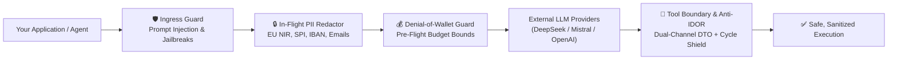
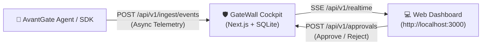

# 🛡️ AvantGate (`avantgate`)

> **The Zero-Infrastructure, In-Process AI Application Firewall (AI-WAF), Deterministic Workflow Engine & Privacy Guard for TypeScript.**  
> Real-time prompt guardrails, zero-egress PII redaction, deterministic Saga workflows, anti-IDOR tool boundary, and pre-flight token defense **without hosting Docker, proxies, PostgreSQL, ClickHouse, or Redis.**

[](https://opensource.org/licenses/MIT)
[](https://www.typescriptlang.org/)
[](https://zod.dev/)
[](#why-avantgate)

---

## ⚡ Why AvantGate? (Active Defense vs. Passive Proxies)

Most LLM security and observability solutions force you into an unacceptable trade-off:
- ❌ **Data Egress & Privacy Hazards**: Cloud AI proxies (Helicone, Portkey) require routing your raw prompts through external third-party servers, creating compliance headaches and data leakage risks.
- ❌ **Network Latency Tax**: External proxies inject **+50ms to 250ms of network overhead** on every single LLM call.
- ❌ **Passive & Post-Mortem**: Traditional observability platforms (Langfuse, LangSmith) log token leaks and PII exposure *after* the damage is done and the money is spent.
- ❌ **Heavy Infrastructure**: Self-hosting requires spinning up Next.js + PostgreSQL + ClickHouse + Redis + S3 just to inspect prompt traffic.

### 🛡️ The AvantGate Philosophy: In-Process Security Boundary
**AvantGate runs entirely inside your existing application process.** No external proxy, no raw prompts leaving your perimeter unredacted, and 0 ms network latency.



---

## 🖥️ GateWall Cockpit — Self-Hosted AI-WAF & Governance Console (`gatewall/`)

While the **AvantGate SDK** provides zero-infrastructure, in-process control inside your application runtime, the included **GateWall Cockpit** (`gatewall/`) provides a full-featured, self-hosted visual control plane, real-time audit inspector, and Human-in-the-Loop approval.



### 🚀 Quickstart: Run GateWall Cockpit

#### Option 1: One-Line Docker Compose (Recommended)
```bash
docker compose up -d
# or: npm run gatewall:docker
```
Open **`http://localhost:3000`** in your browser 🎉. Traces and audit sessions are automatically persisted.

#### Option 2: Run with Bun or Node.js
```bash
cd gatewall
bun install   # or npm install
bun run dev   # or npm run dev
```

---

### 🛡️ Cockpit Capabilities & Modules

| Module | Description |
|---|---|
| **🔒 Dual-Channel PII Inspector** | Visually compare the sequestered local escrow (`rawPayload`) against the redacted summary dispatched to the model (`llmSummary`). Highlights detected PII (emails, API keys, IBANs, phone numbers). |
| **🧑‍⚖️ Human-in-the-Loop (HITL) Queue** | Real-time queue intercepting high-impact tool executions (`WAITING_APPROVAL`) with an interactive dashboard to inspect parameters and click **Approve** or **Reject**. |
| **⚡ Real-Time Streaming (SSE)** | Low-latency Server-Sent Events (`/api/v1/realtime`) updating session trees, metrics, and alerts dynamically without manual page refresh. |
| **💰 FinOps & Token Tracking** | Automated token cost estimation and USD burn tracking across providers (GPT-4o, Claude 3.5 Sonnet, DeepSeek, etc.). |
| **🛡️ Loop Shield (Anti-Cycle Guard)** | Early visual detection of recursive agent loops and aberrant repetitive tool execution cycles. |
| **💾 Zero-External-DB SQLite Storage** | Zero setup overhead: persistent storage uses embedded SQLite (`gatewall/data/gatewall.db`) without requiring PostgreSQL, Redis, or ClickHouse. |

> 💡 **Agent Integration Recipes:** See [Connecting an Agent to GateWall Cockpit](docs/examples.md#12-connecting-an-agent-to-gatewall-cockpit-gatewall) in `docs/examples.md` for complete code recipes using `HttpTelemetryExporter` (`avantgate/agent`), direct HTTP ingestion, and React front-end streaming (`avantgate/client`).

---

### ☁️ Enterprise & Managed Cloud

Looking for enterprise multi-tenant RBAC, SSO/SAML, managed VPC sidecars, or on-premise air-gapped compliance?  
Contact our team at [contact@gatewall.fr](mailto:contact@gatewall.fr) for private previews and enterprise deployment options.

---

## 🚀 Key Security & Defense Features

- 🛡️ **Active Threat Defense & Prompt Guardrails**: Blocks prompt injections, DAN jailbreaks, adversarial noise, and system prompt exfiltration *before* external API invocation.
- 🔒 **Zero-Egress Data Loss Prevention (DLP)**: Automated local redaction of emails, phone numbers, IBAN/BIC, and French/EU identifiers (NIR SSN, SPI tax ID) before network egress.
- ⚡ **Deterministic Workflow Engine (`avantgate/workflow`)**: In-process sequential state machine for multi-step agent orchestrations. Features automatic reverse compensation (Saga Pattern), non-blocking Human-in-the-Loop checkpoints, and safe-by-default AI tool conversion (`asTool()`).
- 🎭 **Dual-Channel Tool Isolation (`avantgate/agent`)**: Decouples sensitive database records (streamed out-of-band directly to client UIs) from minimal cognitive LLM context (`llmDto`), keeping confidential fields out of context windows.
- 🛑 **Anti-IDOR & Multi-Tenant Defense**: Strict Row-Level Security, compile-time tenant tool enforcement (`createTenantTool`), post-fetch runtime assertions (`assertTenant`, `assertOwnership`), and native RBAC authorization at the agent tool boundary. See the [Anti-IDOR Architecture Guide](docs/anti-idor.md).
- 💰 **Denial-of-Wallet & Pre-Flight Budgeting**: Enforces strict token and cent-level USD budget limits, rejecting abusive requests before paying for upstream inference.
- 🔀 **Zero-Downtime Multi-Model Failover**: Seamless client-side failover to fallback providers (or local zero-cost Ollama) when upstream APIs return HTTP 429/500 errors.
- 🔧 **Self-Repairing Structured Outputs**: Strict Zod schema compliance with automated heuristic markdown/JSON repair if the model hallucinates formatting.
- 📡 **Zero-Dependency Telemetry Bridge (`HttpTelemetryExporter`, `PlatformStorageAdapter`)**: Mirror execution audits and hierarchical tool traces asynchronously without adding heavy external dependencies.
- 🌐 **Lightweight Front-End SDK & React Hook (`avantgate/client`)**: Micro-bundle (< 1.7 KB gzipped) for browser UIs. Captures client-side security alerts (blocked API keys, prompt injection attempts), UI render metrics, and user feedback, streaming them directly to gateWall via `fetch(keepalive)` without loading backend infrastructure.
- 📦 **100% Framework Agnostic**: Works seamlessly in Next.js, Express, Fastify, NestJS, Cloudflare Workers, AWS Lambda, or CLI scripts.

---

## 📚 Documentation & Guides

| Category | In-Depth Guides |
|---|---|
| 🚀 **Quickstart** | [Getting Started](docs/getting-started.md) • [Integration Cookbook](docs/examples.md) |
| 🛡️ **Security & AI-WAF** | [Prompt Guardrails](docs/security/prompt-guardrails.md) • [PII Redaction](docs/security/pii-redaction.md) • [Anti-IDOR Defense](docs/security/anti-idor.md) • [End-to-End Security](docs/security/end-to-end-security.md) |
| 💰 **FinOps & Cost** | [Pre-Flight Budget Guards](docs/finops/budget-guards.md) • [Pricing Adapters & SQLite](docs/finops/pricing-adapters.md) |
| 🤖 **Agents & Tools** | [Isolated Tools & DTOs](docs/agents/isolated-tools.md) • [Agent Runtime Manual](docs/agents/agent-runtime.md) • [Inter-Tool Chaining](docs/agents/inter-tool-chaining.md) |
| 🔄 **Deterministic Sagas** | [Durable Workflows Engine](docs/workflows/durable-workflows.md) |
| 📊 **Observability** | [GateWall Cockpit Console](docs/observability/gatewall-cockpit.md) • [Telemetry & Browser SDK](docs/observability/telemetry-and-browser-sdk.md) |
| 💶 **Accounting** | [Financial Normalizer](docs/finance/normalizer.md) |

---

## 📊 Comparison: Direct LLM vs. Cloud AI Proxy vs. AvantGate

| Capability & Security Boundary | Direct LLM Calls | Cloud AI Proxy (Helicone / Portkey) | 🛡️ **AvantGate (`avantgate`)** |
|---|:---:|:---:|:---:|
| **Security Architecture** | None (Direct HTTP) | External Cloud Proxy | **In-Process Security Boundary** |
| **Data Privacy & DLP** | ❌ Raw PII leaves perimeter | ⚠️ Unencrypted prompts transit proxy | ✅ **Sanitized in-flight locally (Zero Egress)** |
| **Network Latency Overhead** | 0 ms | ❌ +50ms - 250ms (Extra hop) | ✅ **0 ms (In-process execution)** |
| **Prompt Injection Defense** | ❌ None | ⚠️ Passive detection | ✅ **Active Pre-Flight Guard (Blocks before spend)** |
| **Agent Tool Data Isolation** | ❌ Entire DB entity in LLM | ❌ No agent tool awareness | ✅ **Dual-Channel DTO (`clientDto` vs `llmDto`)** |
| **Row-Level Security & Anti-IDOR** | ❌ Manual code | ❌ Not supported | ✅ **Native `dataAccessGuard` & Domain Boundary** |
| **Infrastructure Overhead** | None | SaaS Subscription | ✅ **$0 / Zero Servers (Pure npm package)** |
| **Multi-Model Failover** | ❌ App crashes | ⚠️ Proxy-dependent | ✅ **Built-in Fallback Router & Exponential Retry** |
| **Zod Schema Auto-Repair** | ❌ No | ❌ No | ✅ **Built-in JSON Heuristic Repair** |
| **Hierarchical Session Replay** | ❌ None | ⚠️ Flat span waterfall | ✅ **Causality Tree + Dual-Channel Isolation** |

---

## 📦 Installation

```bash
npm install avantgate zod
# or
pnpm add avantgate zod
# or
yarn add avantgate zod
```

### 🧩 Subpath Exports

| Import Path | Description |
|---|---|
| `avantgate` | Core control plane: token budgets, cost ledger, prompt guards, multi-model failover & Zod repair. |
| `avantgate/finance` | Financial data normalizer (accounting parentheses, EU/US/UK/CH currencies & magnitudes). |
| `avantgate/agent` | *(Preview / Experimental)* Durable step runner, Human-in-the-Loop, dual-channel PII tool isolation & storage adapters. |
| `avantgate/workflow` | Deterministic sequential state machine, automatic reverse Saga rollback, durable HITL checkpoints & agent tool conversion. |
| `avantgate/client` | Lightweight front-end SDK (< 1.7 KB) & React hook to stream browser security alerts & metrics directly to GateWall. |

---

## 📖 Documentation & Guides

Comprehensive guides, copy-pasteable integration recipes, and architectural references are available in the dedicated documentation:

| Guide | Description |
|---|---|
| **[Deterministic Workflow Engine](docs/workflow.md)** | Zero-infra Saga orchestrator, linear FSM rationale, reverse compensation, HITL checkpoints & agent tool conversion. |
| **[Code Examples & Recipes](docs/examples.md)** | End-to-end security guardrails, PII redaction, anti-IDOR tool boundaries, cost tracking, Zod self-repair, and multi-model failover. |
| **[Decoupled Pricing & DB Adapters](docs/pricing.md)** | Dynamic token pricing, database integration (Prisma / PostgreSQL / Drizzle), in-memory TTL caching, and runtime overrides. |
| **[Durable Agent Harness & Tool Isolation](docs/agent.md)** | Serverless durable step execution, Human-in-the-Loop suspension, dual-channel DTO tool isolation, and telemetry streaming. |

---

## 🏗️ Architecture & Extensibility

AvantGate is built around clean **Ports and Adapters**:

- **`LLMProviderPort`**: Abstract interface allowing you to plug any custom provider (Azure OpenAI, Bedrock, vLLM).
- **`AuditSinkPort`**: Pluggable telemetry sink. Export metrics to `console`, local SQLite, or OpenTelemetry with zero overhead.

---

## 🗺️ Roadmap & Milestones

### 🎯 Core Control Plane (`avantgate`)

1. ⏱️ **In-Process Sliding-Window Rate Limiter & User Quotas**
   - In-memory token bucket per User ID, IP address, or session without Redis.
   - Per-user daily & hourly token budget limits with automatic graceful throttling.

2. 🔒 **Bidirectional Sanitizer & Secret Leak Prevention**
   - Extend PII protection from input queries to **model outputs and audit logs**.
   - Active inspection to prevent LLM hallucinations from leaking server credentials, environment variables (`sk-...`, JWTs), or raw system instructions to client frontends.

3. ⚡ **Spend Velocity Circuit Breaker & Exponential Backoff**
   - Real-time spend velocity detection (trips if spend exceeds $X within Y minutes).
   - Configurable exponential backoff retries before triggering provider failover.
   - Safe degradation returning user-friendly messages instead of raw provider crashes.

4. ⚖️ **Real-Time Evaluation Quality Gates**
   - Replace gut-feel and vibe-based evaluations with in-process, measurable output quality gates.
   - Built-in sub-millisecond heuristic gates:
     - **Refusal & Boilerplate Gate**: Detects unwanted refusal phrasing (*"As an AI..."*) and triggers fallback.
     - **Context Grounding Gate**: Verifies factual entity containment against supplied reference text.
   - Automated corrective retry loop (`onFailure: "retry_with_feedback"`) or instant model failover.

5. 🔌 **Lifecycle Middleware Hooks (`beforeRequest`, `afterResponse`)**
   - Extensible middleware pipeline to inspect, enrich, or modify prompts and completions without modifying core logic.
   - Universal hook allowing any external RAG system or context engine to compose with AvantGate seamlessly.

6. 🚀 **One-Line Launch-Safe Presets (`PRESETS.LAUNCH_SAFE`)**
   - Zero-config hardened setup with sensible defaults for security, budgets, and failovers.

### 📦 Modular Ecosystem & Extensions

- **`avantgate/workflow`**: Deterministic sequential state machine, automatic reverse Saga rollback ($k-1 \to 0$), and durable HITL checkpoints.
- **`avantgate/agent`**: Zero-infra durable step orchestration, human-in-the-loop pauses, and dual-channel PII tool isolation.
- **`avantgate/finance`**: Zero-overhead financial accounting normalizer across international jurisdictions (FR PCG, US GAAP, UK IFRS, Swiss CO).
- **Launch Readiness Linter**: Standalone developer tool to audit codebases before launch for exposed keys, unbudgeted endpoints, and missing guards.

---

## 🤝 Contributing

Contributions are welcome! Please read our [CONTRIBUTING.md](CONTRIBUTING.md) to get started.

```bash
git clone https://github.com/your-org/avantgate.git
cd avantgate
npm install
npm test
```

---

## 🙏 Acknowledgements & Credits

AvantGate builds upon foundational ideas and inspirations from the open source AI engineering and durable execution communities:

### 🛡️ In-Process Control & Production Layers
- Special credit to [**Emmimal/control-layer**](https://github.com/Emmimal/control-layer) for pioneering the in-process control layer architecture.
- Valuable insights and launch safety principles inspired by [**ShipYourAI.com**](https://shipyourai.com).
- **[context-engine](https://github.com/Emmimal/context-engine)** — Retrieval, re-ranking, memory decay, and token budget control for RAG systems. *The control layer handles what the model returns. The context engine handles what it receives. They compose.*
- **[RAG Is Blind to Time — Temporal Layer](https://github.com/Emmimal/temporal-layer)** — Temporal awareness layer for RAG systems that treats time as a first-class retrieval signal.
- **[LLM Evals Are Based on Vibes — Evaluation Layer](https://github.com/Emmimal/eval-layer)** — Evaluation layer that replaces gut-feel shipping decisions with measurable output quality gates.
- **[PyTorch NaNs Are Silent Killers — NaN Catch Hook](https://github.com/Emmimal/nan-hook)** — Lightweight hook that catches NaN propagation at the exact layer it originates, in under 3ms overhead.

### 📊 FinOps & Observability Platforms
- **[Helicone](https://github.com/Helicone/helicone)** — Pioneering LLM request caching, granular cost estimation, and developer-first proxy design that inspired our FinOps engine and semantic tool caching patterns.
- **[AgentOps](https://github.com/AgentOps-AI/agentops)** — State-of-the-art agent tracking, session replay visualization, and recursive loop detection that inspired our Session Replay and Infinite Loop Shield.

### 🤖 Durable Workflows & Agent Architecture (`avantgate/agent` & `avantgate/workflow`)
- **Deterministic FSM & Saga Pattern** — Architectural rejection of fragile cyclic graphs in favor of strictly ordered, hallucination-resistant linear state machines with mathematically guaranteed reverse rollback ($k-1 \to 0$).
- **[Inngest](https://www.inngest.com)** & **[Temporal](https://temporal.io)** — The developer experience of durable step memoization (`step.run()`) and human validation pauses (`step.waitForApproval()`), reimagined here as a **$0-infrastructure, serverless in-process harness** without requiring external worker queues or Redis clusters.
- **[Vercel AI SDK (`ai`)](https://sdk.vercel.ai)** — Standardized TypeScript tool schema contracts (`parameters`, `execute`) natively embraced and augmented by `createIsolatedTool`.
- **Least-Privilege & Dual-Channel Isolation** — Security patterns separating sensitive payload data (streamed out-of-band directly to trusted user interfaces) from LLM prompts (receiving sanitized summaries), preventing context pollution and PII leakage.
- **Alistair Cockburn's Ports & Adapters (Hexagonal Architecture)** — Pure domain isolation enabling developers to plug any database (Prisma, SQLite, Drizzle, Kysely, Mongo, Redis) with zero hard framework dependencies.

---

## 📜 License

MIT License © 2026 AvantGate Contributors. Built with pride for developers who value performance, simplicity, and zero-infra architecture.

