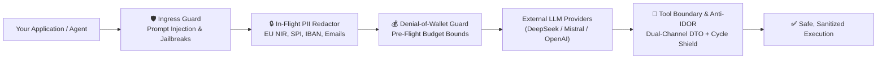
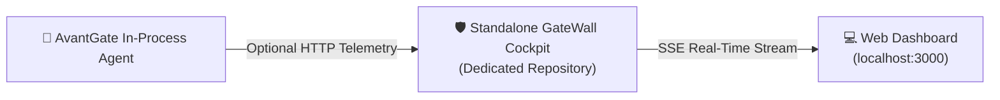

# 🛡️ AvantGate (`avantgate`)

> **The Zero-Infrastructure, In-Process AI Application Firewall (AI-WAF), Deterministic Workflow Engine, Privacy Guard & Headless UI Canvas for TypeScript.**  
> Real-time prompt guardrails, zero-egress PII redaction, deterministic Saga workflows, canonical tool envelopes, anti-IDOR tool boundary, and pre-flight token defense **without hosting Docker, proxies, PostgreSQL, ClickHouse, or Redis.**

[](https://opensource.org/licenses/MIT)
[](https://www.typescriptlang.org/)
[](https://zod.dev/)
[](#why-avantgate)

---

## ⚡ Why AvantGate? (Active Defense vs. Passive Proxies)

Most LLM security and observability solutions force you into an unacceptable trade-off:
- ❌ **Data Egress & Privacy Hazards**: Cloud AI proxies (Helicone, Portkey) require routing your raw prompts through external third-party servers, creating compliance headaches and data leakage risks.
- ❌ **Network Latency Tax**: External proxies inject **+50ms to 250ms of network overhead** on every single LLM call.
- ❌ **Passive & Post-Mortem**: Traditional observability platforms (Langfuse, LangSmith) log token leaks and PII exposure *after* the damage is done and the money is spent.
- ❌ **Heavy Infrastructure**: Self-hosting requires spinning up Next.js + PostgreSQL + ClickHouse + Redis + S3 just to inspect prompt traffic.

### 🛡️ The AvantGate Philosophy: In-Process Security Boundary
**AvantGate runs entirely inside your existing application process.** No external proxy, no raw prompts leaving your perimeter unredacted, and 0 ms network latency.


```mermaid
flowchart LR
    App[Your Application / Agent] --> InputGuard[🛡️ Ingress Guard<br/>Prompt Injection & Jailbreaks]
    InputGuard --> PIIShield[🔒 In-Flight PII Redactor<br/>EU NIR, SPI, IBAN, Emails]
    PIIShield --> TokenBudget[💰 Denial-of-Wallet Guard<br/>Pre-Flight Budget Bounds]
    TokenBudget --> Providers["External LLM Providers<br/>(DeepSeek / Mistral / OpenAI)"]
    Providers --> ToolBoundary[🛑 Tool Boundary & Anti-IDOR<br/>Dual-Channel DTO + Cycle Shield]
    ToolBoundary --> SafeOutput[✅ Safe, Sanitized Execution]
```

---

## 🖥️ Optional Visual Cockpit — GateWall (`gatewall`)

While the **AvantGate SDK (`avantgate`)** runs **100% headless and in-process** inside your application runtime (zero servers, zero network latency), an optional visual control plane, **GateWall**, is available as a standalone repository for teams requiring a visual dashboard, real-time audit inspector, and Human-in-the-Loop approval interface.


```mermaid
flowchart LR
    Agent[🤖 AvantGate In-Process Agent] -- "Optional HTTP Telemetry" --> GateWall["🛡️ Standalone GateWall Cockpit<br/>(Dedicated Repository)"]
    GateWall -- "SSE Real-Time Stream" --> Browser["💻 Web Dashboard<br/>(localhost:3000)"]
```

> 💡 **Standalone Repository:** GateWall Cockpit is maintained independently at `../gatewall`. If your application runs headless, you do **not** need to deploy or run GateWall — all guardrails, PII redactions, and token budgets execute directly within your Node.js process.

---

### 🛡️ Cockpit Capabilities & Modules

| Module | Description |
|---|---|
| **🔒 Dual-Channel PII Inspector** | Visually compare the sequestered local escrow (`rawPayload`) against the redacted summary dispatched to the model (`llmSummary`). Highlights detected PII (emails, API keys, IBANs, phone numbers). |
| **🧑‍⚖️ Human-in-the-Loop (HITL) Queue** | Real-time queue intercepting high-impact tool executions (`WAITING_APPROVAL`) with an interactive dashboard to inspect parameters and click **Approve** or **Reject**. |
| **⚡ Real-Time Streaming (SSE)** | Low-latency Server-Sent Events (`/api/v1/realtime`) updating session trees, metrics, and alerts dynamically without manual page refresh. |
| **💰 FinOps & Token Tracking** | Automated token cost estimation and USD burn tracking across providers (GPT-4o, Claude 3.5 Sonnet, DeepSeek, etc.). |
| **🛡️ Loop Shield (Anti-Cycle Guard)** | Early visual detection of recursive agent loops and aberrant repetitive tool execution cycles. |
| **💾 Pluggable Hexagonal Storage** | Zero setup overhead by default with embedded SQLite (`gatewall/data/gatewall.db`), zero-disk in-memory storage for CI tests, and production-ready PostgreSQL/Prisma adapter (`STORAGE_DRIVER=prisma`). |
| **🔏 Custom Redaction Terms Manager** | Interactive visual manager in the Security Cockpit to register, categorize (Project, Company, Infra), and redact proprietary secrets and NDA keywords in-flight. |

> 💡 **Agent Integration Recipes:** See [GateWall Telemetry Recipe](examples/observability/10-gatewall-telemetry.ts) and [Integration Cookbook](examples/README.md) for complete code recipes using `HttpTelemetryExporter` (`avantgate/agent`), direct HTTP ingestion, and React front-end streaming (`avantgate/client`).

---

### ☁️ Enterprise & Managed Cloud

Looking for enterprise multi-tenant RBAC, SSO/SAML, managed VPC sidecars, or on-premise air-gapped compliance?  
Contact our team at [contact@gatewall.fr](mailto:contact@gatewall.fr) for private previews and enterprise deployment options.

---

## 🚀 Key Security & Defense Features

| Pillar | Core Capabilities & Architecture |
|---|---|
| 🛡️ **AI-WAF & Privacy** | • **Prompt Guardrails**: Blocks prompt injections, jailbreaks & exfiltration *pre-flight*.<br/>• **Zero-Egress DLP**: In-process redaction of emails, phone numbers, IBANs & EU tax IDs.<br/>• **Bidirectional Secret Guard**: Active DLP masking of API keys & database credentials in LLM outputs and error traces.<br/>• **Self-Repairing Outputs**: Native Zod validation with automatic JSON heuristic repair. |
| 🛑 **Agent Isolation & Anti-IDOR** | • **Dual-Channel DTOs**: Streams full records to UI while injecting sanitized summaries into LLM.<br/>• **Anti-IDOR Boundary**: Compile-time tenant scoping (`createTenantTool`) & runtime ownership checks.<br/>• **Server Idempotency Guard**: Zero-infra in-process guard (`withServerIdempotency`) with memory or storage adapters.<br/>• **Infinite Loop Shield**: Detects and breaks recursive agent tool execution loops. |
| 💰 **FinOps & Resilience** | • **Denial-of-Wallet**: Enforces hard token & USD budgets *before* external inference spend.<br/>• **Multi-Model Failover**: Instant client-side routing to fallback models or local Ollama on 429/500.<br/>• **FinOps Batch Deduplication**: Prevents double-counting of tokens & costs during network retries on GateWall.<br/>• **Live Cost Ledger**: Token burn calculation & pricing adapters with zero external DB. |
| ⚡ **Sagas, Replay & Telemetry** | • **Deterministic Sagas (`avantgate/workflow`)**: In-process FSM with automatic reverse compensation ($k-1 \to 0$).<br/>• **In-Context Replay (`avantgate/client`)**: React hook (`useTask`) with causal parent linkage (`parentRunId`) & `Idempotency-Key`.<br/>• **Human-in-the-Loop (HITL)**: Non-blocking suspension, approval queues & fail-closed 24h SLA timeout (TTL).<br/>• **Lightweight Telemetry**: < 1.7 KB client SDK & async audit bridge to GateWall. |
| 🎨 **Presentation Plane (`avantgate/ui`)** | • **Canonical Tool Envelopes**: Typed format carrying merge strategies (`REPLACE`, `APPEND_UNIQUE`, `UPDATE_ENTITY`) & `UIIntent`.<br/>• **Deterministic Concurrency Reducer**: Algebraic $O(N)$ Set-based convergence solving parallel tool calling races.<br/>• **React View Registry (`avantgate/ui/react`)**: Polymorphic $O(1)$ dynamic dispatch linking tools to your design system (shadcn/ui).<br/>• **Native Anti-XSS Guard**: Zero-dependency WHATWG `URL` scanner neutralizing `javascript:` & protocol-relative (`//evil.com`) vectors. |

---

## 📚 Documentation & Guides

| Category | In-Depth Guides |
|---|---|
| 🚀 **Quickstart** | [Getting Started](docs/getting-started.md) • [Integration Cookbook](examples/README.md) |
| 🛡️ **Security & AI-WAF** | [Prompt Guardrails](docs/security/prompt-guardrails.md) • [PII Redaction](docs/security/pii-redaction.md) • [Anti-IDOR Defense](docs/security/anti-idor.md) • [End-to-End Security](docs/security/end-to-end-security.md) |
| 💰 **FinOps & Cost** | [Pre-Flight Budget Guards](docs/finops/budget-guards.md) • [Pricing Adapters & SQLite](docs/finops/pricing-adapters.md) |
| 🤖 **Agents & Tools** | [Isolated Tools & DTOs](docs/agents/isolated-tools.md) • [Agent Runtime Manual](docs/agents/agent-runtime.md) • [Inter-Tool Chaining](docs/agents/inter-tool-chaining.md) |
| 🔄 **Deterministic Sagas** | [Durable Workflows Engine](docs/workflows/durable-workflows.md) |
| 📊 **Observability & Cockpit** | [GateWall Cockpit Console](docs/observability/gatewall-cockpit.md) • [Telemetry & Browser SDK](docs/observability/telemetry-and-browser-sdk.md) • [GateWall vs. Temporal](docs/observability/temporal-and-gatewall.md) |
| 💶 **Accounting** | [Financial Normalizer](docs/finance/normalizer.md) |
| 🎨 **Presentation Plane** | [Headless UI Canvas & React Bindings](docs/ui/headless-canvas.md) |
| 🚀 **Release Notes** | [v2.3.0 Release Notes](docs/release/release-2.3.0.md) • [v2.2.0 Release Notes](docs/release/release-2.2.0.md) • [v2.1.0 Release Notes](docs/release/release-2.1.0.md) • [v2.0.0 Release Notes](docs/release/release-2.0.0.md) • [v1.9.0 Release Notes](docs/release/release-1.9.0.md) |

---

## 📊 Comparison: Direct LLM vs. Cloud AI Proxy vs. AvantGate

| Capability & Security Boundary | Direct LLM Calls | Cloud AI Proxy (Helicone / Portkey) | 🛡️ **AvantGate (`avantgate`)** |
|---|:---:|:---:|:---:|
| **Security Architecture** | None (Direct HTTP) | External Cloud Proxy | **In-Process Security Boundary** |
| **Data Privacy & DLP** | ❌ Raw PII leaves perimeter | ⚠️ Unencrypted prompts transit proxy | ✅ **Sanitized in-flight locally (Zero Egress)** |
| **Network Latency Overhead** | 0 ms | ❌ +50ms - 250ms (Extra hop) | ✅ **0 ms (In-process execution)** |
| **Prompt Injection Defense** | ❌ None | ⚠️ Passive detection | ✅ **Active Pre-Flight Guard (Blocks before spend)** |
| **Agent Tool Data Isolation** | ❌ Entire DB entity in LLM | ❌ No agent tool awareness | ✅ **Dual-Channel DTO (`clientDto` vs `llmDto`)** |
| **Row-Level Security & Anti-IDOR** | ❌ Manual code | ❌ Not supported | ✅ **Native `dataAccessGuard` & Domain Boundary** |
| **Bidirectional Idempotency** | ❌ Manual / none | ⚠️ Basic header relay | ✅ **Native causal key derivation + server guard + batch deduplication** |
| **Infrastructure Overhead** | None | SaaS Subscription | ✅ **$0 / Zero Servers (Pure npm package)** |
| **Multi-Model Failover** | ❌ App crashes | ⚠️ Proxy-dependent | ✅ **Built-in Fallback Router & Exponential Retry** |
| **Zod Schema Auto-Repair** | ❌ No | ❌ No | ✅ **Built-in JSON Heuristic Repair** |
| **Hierarchical Session Replay** | ❌ None | ⚠️ Flat span waterfall | ✅ **Causality Tree + In-Context Replay (`useTask`)** |
| **Headless UI Canvas State** | ❌ Manual parsing | ❌ Not supported | ✅ **Canonical Envelopes + Parallel Reducer (`avantgate/ui`)** |

---

## 📦 Installation

```bash
npm install avantgate zod
# or
pnpm add avantgate zod
# or
yarn add avantgate zod
```

> 🚀 **Quickstart Guide:** See [**Getting Started with AvantGate**](docs/getting-started.md) for 3-minute quickstart recipes with launch-safe presets and compile-time anti-IDOR tools.

### 🧩 Subpath Exports

| Import Path | Description | Documentation |
|---|---|---|
| `avantgate` | Core control plane: token budgets, cost ledger, prompt guards, multi-model failover & Zod repair. | [Getting Started](docs/getting-started.md) |
| `avantgate/finance` | Financial data normalizer (accounting parentheses, EU/US/UK/CH currencies & magnitudes). | [Financial Normalizer](docs/finance/normalizer.md) |
| `avantgate/agent` | Durable step runner, Human-in-the-Loop, dual-channel PII tool isolation, server idempotency (`withServerIdempotency`), & storage adapters. | [Isolated Tools & DTOs](docs/agents/isolated-tools.md) |
| `avantgate/workflow` | Deterministic sequential state machine, automatic reverse Saga rollback, durable HITL checkpoints & agent tool conversion. | [Durable Workflows](docs/workflows/durable-workflows.md) |
| `avantgate/client` | Front-end SDK (< 1.7 KB) with in-context task replay (`useTask`, `createTaskRunner`), causal idempotency helpers (`getIdempotencyHeaders`), & GateWall telemetry adapter. | [Telemetry & Browser SDK](docs/observability/telemetry-and-browser-sdk.md) |
| `avantgate/ui` | Headless UI canvas core (< 2.5 KB): canonical tool envelopes, deterministic $O(N)$ parallel reducer, `defineCanvas` factory. | [Headless UI Canvas](docs/ui/headless-canvas.md) |
| `avantgate/ui/react` | React presentation plane: polymorphic $O(1)$ view registry (`createViewRegistry`), `CanvasRenderer`, & anti-XSS URL sanitizer (`isValidSafeUrl`). | [Headless UI Canvas](docs/ui/headless-canvas.md) |

> 💡 **UI Canvas Cookbook:** See [Headless UI Canvas & React Bindings](docs/ui/headless-canvas.md) for complete step-by-step recipes connecting agent tools with typed envelopes and custom React views (shadcn/ui, Tailwind).

---

## 🏗️ Architecture & Extensibility

AvantGate is built around clean **Ports and Adapters**:

- **`LLMProviderPort`**: Abstract interface allowing you to plug any custom provider (Azure OpenAI, Bedrock, vLLM).
- **`AuditSinkPort`**: Pluggable telemetry sink. Export metrics to `console`, local SQLite, or OpenTelemetry with zero overhead.

---

## 🗺️ Roadmap & Milestones

Interested in upcoming features (output DLP & secret leak guard, lifecycle hooks, launch-safe presets) or release history See [**ROADMAP.md**](ROADMAP.md).

---

## 🤝 Contributing

Contributions are welcome! Please read our [CONTRIBUTING.md](CONTRIBUTING.md) to get started.

```bash
git clone https://github.com/your-org/avantgate.git
cd avantgate
npm install
npm test
```

---

## 🙏 Acknowledgements & Credits

AvantGate builds upon foundational ideas and inspirations from the open source AI engineering and durable execution communities:

### 🛡️ In-Process Control & Production Layers
- Special credit to [**Emmimal/control-layer**](https://github.com/Emmimal/control-layer) for pioneering the in-process control layer architecture.
- Valuable insights and launch safety principles inspired by [**ShipYourAI.com**](https://shipyourai.com).
- **[context-engine](https://github.com/Emmimal/context-engine)** — Retrieval, re-ranking, memory decay, and token budget control for RAG systems. *The control layer handles what the model returns. The context engine handles what it receives. They compose.*
- **[RAG Is Blind to Time — Temporal Layer](https://github.com/Emmimal/temporal-layer)** — Temporal awareness layer for RAG systems that treats time as a first-class retrieval signal.
- **[LLM Evals Are Based on Vibes — Evaluation Layer](https://github.com/Emmimal/eval-layer)** — Evaluation layer that replaces gut-feel shipping decisions with measurable output quality gates.
- **[PyTorch NaNs Are Silent Killers — NaN Catch Hook](https://github.com/Emmimal/nan-hook)** — Lightweight hook that catches NaN propagation at the exact layer it originates, in under 3ms overhead.

### 📊 FinOps & Observability Platforms
- **[Helicone](https://github.com/Helicone/helicone)** — Pioneering LLM request caching, granular cost estimation, and developer-first proxy design that inspired our FinOps engine and semantic tool caching patterns.
- **[AgentOps](https://github.com/AgentOps-AI/agentops)** — State-of-the-art agent tracking, session replay visualization, and recursive loop detection that inspired our Session Replay and Infinite Loop Shield.

### 🤖 Durable Workflows & Agent Architecture (`avantgate/agent` & `avantgate/workflow`)
- **Deterministic FSM & Saga Pattern** — Architectural rejection of fragile cyclic graphs in favor of strictly ordered, hallucination-resistant linear state machines with mathematically guaranteed reverse rollback ($k-1 \to 0$).
- **[Inngest](https://www.inngest.com)** & **[Temporal](https://temporal.io)** — The developer experience of durable step memoization (`step.run()`) and human validation pauses (`step.waitForApproval()`), reimagined here as a **$0-infrastructure, serverless in-process harness** without requiring external worker queues or Redis clusters.
- **[Vercel AI SDK (`ai`)](https://sdk.vercel.ai)** — Standardized TypeScript tool schema contracts (`parameters`, `execute`) natively embraced and augmented by `createIsolatedTool`.
- **Least-Privilege & Dual-Channel Isolation** — Security patterns separating sensitive payload data (streamed out-of-band directly to trusted user interfaces) from LLM prompts (receiving sanitized summaries), preventing context pollution and PII leakage.
- **Alistair Cockburn's Ports & Adapters (Hexagonal Architecture)** — Pure domain isolation enabling developers to plug any database (Prisma, SQLite, Drizzle, Kysely, Mongo, Redis) with zero hard framework dependencies.

---

## 📜 License

MIT License © 2026 AvantGate Contributors. Built with pride for developers who value performance, simplicity, and zero-infra architecture.

