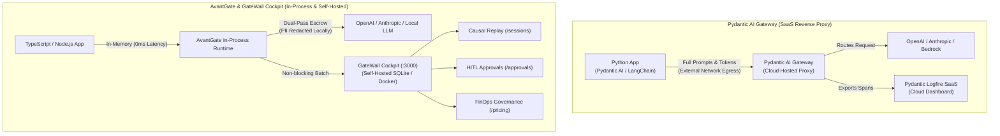

# ⚖️ GateWall vs. Pydantic AI Gateway & Logfire

> **Architectural Comparison:**  
> **Pydantic AI Gateway (Logfire)** is a **cloud SaaS reverse-proxy** primarily designed for routing Python LLM calls and collecting OpenTelemetry traces on their hosted platform.  
> **AvantGate & GateWall** is an **in-process AI security firewall, agent action governance plane, and self-hosted Next.js Cockpit** designed for the modern TypeScript/JavaScript ecosystem with zero data egress.

---

## 🏛️ Architectural Overview: In-Process Firewall vs. Cloud SaaS Proxy

---

## ⚡ Key Architectural Pillars

### 1. Zero-Egress & Data Sovereignty (Dual-Pass Escrow vs. Cloud Proxy)
* **Pydantic AI Gateway:** Routes every prompt, tool payload, and model completion through Pydantic's hosted cloud proxy servers. For enterprises bound by **GDPR, HIPAA, or SOC2**, routing sensitive customer data through an intermediary SaaS introduces compliance risks and third-party audit burdens.
* **AvantGate / GateWall:** Operates **completely in-process within your own VPC or cluster**. Sensitive payloads remain under local encrypted escrow ([Dual-Pass Architecture](../security/pii-redaction.md)). Only sanitized, masked representations (`llmSummary`) ever touch external LLMs or telemetry streams. Your logs are stored locally in SQLite (`gatewall.db`)—no data leaves your infrastructure.

### 2. Full Agentic Governance vs. Simple LLM Request Routing
* **Pydantic AI Gateway:** Functions at the network level as an LLM router (similar to LiteLLM or Cloudflare AI Gateway). It intercepts HTTP requests to check model quotas and latency, but is oblivious to what the agent is *doing* inside your application.
* **AvantGate / GateWall:** Operates at the **Agent Execution layer**:
  * **[`IsolatedTool`](../agents/isolated-tools.md) Blast Radius:** Enforces role-based access control, parameter validation, and immutability guards on actual tool functions (e.g., database writes, financial transactions).
  * **Loop Shield (Infinite Loop Breaker):** Actively monitors causal chains of agent actions to detect recursive hallucinations and trips circuit breakers *before* tools drain accounts or corrupt databases.
  * **Saga Rollback Engine:** Automatically triggers reverse compensation handlers ([`rollbackSaga`](../workflows/durable-workflows.md)) when a multi-step agent workflow fails midway.

### 3. Active Human-in-the-Loop (HITL) vs. Passive Telemetry Logging
* **Pydantic AI Gateway / Logfire:** Focuses on *observability* (OpenTelemetry tracing, flame graphs, latency metrics, and error rates). If a dangerous agent action requires human approval, Logfire has no built-in interactive control mechanism.
* **GateWall Cockpit:** A **mission control console** equipped with an interactive **Approval Queue** (`/approvals`):
  * When an agent attempts a sensitive action, it calls `step.waitForApproval()`.
  * The operation suspends execution safely without holding server threads.
  * Operators visually inspect the redacted payload in GateWall Cockpit and click **Approve** or **Reject** with an audit comment.

### 4. Language & Stack Native: Modern TypeScript vs. Python Legacy
* **Pydantic AI Gateway:** Rooted primarily in the Python ecosystem (Pydantic, FastAPI). While it accepts HTTP requests from any client, its primary ergonomics and features are centered around Python developers.
* **AvantGate:** Purpose-built for **TypeScript, Node.js, Next.js, Bun, and Edge runtimes**. It utilizes **Zod** for end-to-end schema validation, compile-time type safety, and zero-dependency performance (< 1.7 KB client SDK).

---

## 📊 Comprehensive Comparison Matrix

| Feature | **Pydantic AI Gateway (Logfire)** | **AvantGate & GateWall** |
|---|---|---|
| **Primary Architecture** | Hosted Cloud Reverse-Proxy (SaaS) | In-Process Runtime Library + Self-Hosted Console |
| **Hosting Model** | Proprietary SaaS (Pydantic Cloud) | 100% Self-Hosted (Docker Compose / Single Binary) |
| **Network Hop Overhead** | +15ms to +50ms per call (Proxy latency) | **0 ms** (In-memory execution) |
| **Data Privacy & PII** | Transits through Pydantic SaaS infrastructure | **Dual-Pass Escrow** (Zero-egress local sanitization) |
| **Agent Tool Sandboxing** | ❌ None (sees only HTTP text) | ✅ **Native** ([`IsolatedTool`](../agents/isolated-tools.md), role boundaries) |
| **Infinite Loop Defense** | ⚠️ Spend limits only (after the fact) | ✅ **Causal Loop Shield** (Real-time circuit breaker) |
| **Multi-Step State Machine** | ❌ Relies on external orchestrators | ✅ **Sequential Linear FSM with Saga Compensation** |
| **HITL Approvals Queue** | ❌ Not available (passive logging only) | ✅ **Interactive Web Cockpit** ([`ApprovalsView`](../../gatewall/features/approvals/ApprovalsView.tsx)) |
| **FinOps Cost Engine** | Project/Key budget limits in Logfire | Dynamic pricing tables in SQLite, real-time per-token tracking |
| **Primary Language** | Python (Pydantic / FastAPI) | TypeScript / JavaScript (Zod / Next.js) |
| **Infrastructure Tax** | Paid monthly SaaS tier | **$0 Infrastructure Tax** (Embedded SQLite, no external DB) |

---

## 🎯 When to Use Which?

### Choose Pydantic AI Gateway / Logfire If:
1. Your backend is built entirely in **Python** using `pydantic-ai` or `FastAPI`.
2. You prefer an entirely **managed SaaS solution** where you do not want to host any dashboard or database.
3. Your primary requirement is simple LLM provider routing and OpenTelemetry trace visualization.

### Choose AvantGate & GateWall If:
1. You are developing with **TypeScript, Node.js, Next.js, or Bun**.
2. You handle **strictly confidential data** (banking, medical, PII) that must never transit through a third-party proxy.
3. You need **active governance over agent actions and tools**, not just passive prompt logging.
4. You require an **out-of-the-box Human-in-the-Loop console** for business or security operators.
5. You want a **self-hosted, $0 infrastructure-tax solution** that deploys with `docker compose up`.

---

## 🔗 Related Guides

* [GateWall Cockpit Console Documentation](gatewall-cockpit.md)
* [GateWall & Temporal Architecture (Durable Execution)](temporal-and-gatewall.md)
* [Isolated Tools & Sandboxed Execution](../agents/isolated-tools.md)
* [Deterministic Workflow Engine & Saga Rollbacks](../workflows/durable-workflows.md)
