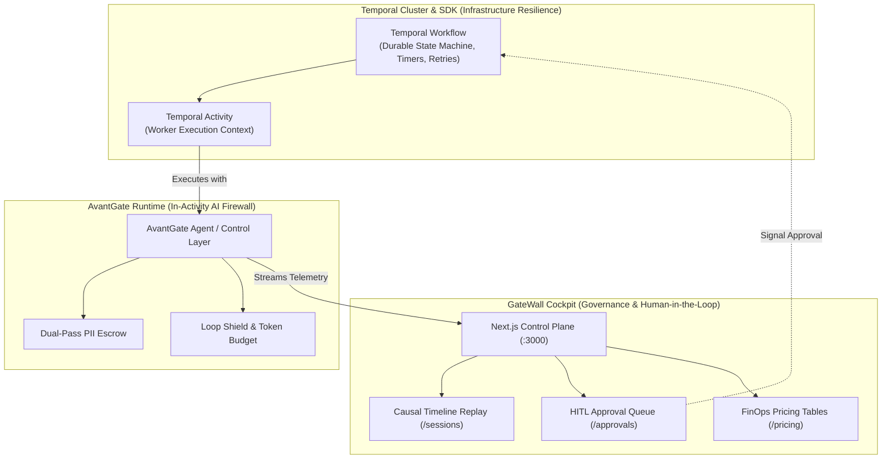

# 🤝 GateWall & Temporal — Durable Execution Meets AI Safety

> **Architectural Complementarity:**  
> **Temporal** guarantees that code runs to completion across crashes and network partitions (*Infrastructure Resilience*).  
> **GateWall / AvantGate** guarantees that AI agent actions remain secure, compliant, within budget, and auditable (*AI Safety & FinOps Control Plane*).

---

## 🧭 Executive Summary: Complementary, Not Competitors

In production distributed systems, engineering teams often ask:  
*"Should we use Temporal or GateWall for our agent workflows?"*

The answer is: **they operate at different layers of the software stack and are designed to work together seamlessly.**



| Dimension | **Temporal.io** | **AvantGate / GateWall** |
|---|---|---|
| **Core Mission** | General-purpose durable execution & microservice orchestration. | AI safety firewall, data sanitization, and FinOps control plane. |
| **Primary Question** | *"Will this piece of code run to completion regardless of server crashes?"* | *"Is this agent action safe, authorized, within budget, and compliant with privacy laws?"* |
| **Payload Awareness** | **Opaque Bytes**: Agnostic of prompts, tokens, hallucinations, or injections. | **Semantic & AI-Native**: Understands token budgets, prompt injection vectors, and PII. |
| **Data Retention** | Persists raw activity payloads in an immutable event history. | Sanitizes prompts and isolates sensitive payloads locally via **Dual-Pass Escrow**. |
| **Cost Management** | No financial or token tracking. | Real-time dynamic pricing per million tokens, model failover, and budget circuit breakers. |
| **Human Validation** | Low-level developer signals (`Workflow.signal`, `waitForSignal`). | Pre-built web console with visual side-by-side inspection (`/approvals`). |

---

## ⚡ The 3 Critical Gaps in Temporal for AI (Solved by GateWall)

### 1. The Immutable Event History vs GDPR / HIPAA Dilemma
* **The Temporal Risk:** Temporal writes every activity input, output, and failure into an append-only, immutable **Event History**. If an LLM or agent tool handles unmasked personal data (credit card numbers, patient records, PII), that data becomes permanently etched into the Temporal database, violating GDPR "Right to be Forgotten" and HIPAA standards.
* **The GateWall Solution:** With **Dual-Pass Data Isolation**, the agent's raw payload stays in a local, encrypted ephemeral escrow. Only a masked, structural summary (`llmSummary`) is forwarded to the LLM and the telemetry stream. The Temporal activity can persist the sanitized reference without polluting the immutable history.

### 2. Unbounded Activity Retries vs Financial Bleeding
* **The Temporal Risk:** Temporal's hallmark feature is resilient retry policies (`backoffCoefficient`, `maximumAttempts: 100`). However, in LLM architectures, an unhandled prompt error or model drift is often non-transient. Retrying an expensive multi-step agent prompt 20 times can drain thousands of dollars in minutes.
* **The GateWall Solution:** AvantGate enforces **real-time token and USD budget ceilings** and a **Loop Shield**. If an agent begins looping or approaches its cost ceiling, AvantGate trips the circuit breaker *before* Temporal triggers a catastrophic financial retry cycle.

### 3. Turnkey Human-in-the-Loop (HITL) Console
* **The Temporal Risk:** Implementing human validation in Temporal requires:
  1. Defining custom signals in your workflow.
  2. Building, authenticating, and hosting a bespoke web frontend for business operators.
  3. Formatting raw JSON payloads for human review.
* **The GateWall Solution:** GateWall Cockpit provides an immediate, ready-to-run Next.js dashboard ([`ApprovalsView`](../../gatewall/features/approvals/ApprovalsView.tsx)). Operators review flagged actions with full visual context and click **Approve** or **Reject**. When decided, Cockpit dispatches a signal back to the Temporal workflow.

---

## 💻 Implementation Pattern: AvantGate inside a Temporal Activity

In this hybrid architecture, Temporal orchestrates the distributed workflow while AvantGate secures every tool call and LLM generation:

```typescript
// activities/enrichCustomerActivity.ts
import { HttpTelemetryExporter, PlatformStorageAdapter, createIsolatedTool } from "avantgate/agent";
import { z } from "zod";

// 1. Initialize GateWall Telemetry Exporter
const exporter = new HttpTelemetryExporter({
  endpoint: process.env.GATEWALL_ENDPOINT || "http://localhost:3000/api/v1/ingest/events",
  agentName: "CustomerOnboardingWorker",
});

// 2. Define the secured agent tool with AvantGate
const updateCustomerCRM = createIsolatedTool({
  id: "crm.updateCustomer",
  description: "Updates high-value enterprise customer records",
  inputSchema: z.object({
    customerId: z.string(),
    revenueARR: z.number(),
    contactEmail: z.string().email(),
  }),
  // Dual-Pass PII & Security Guard
  maskPII: true,
  riskLevel: "HIGH",
  execute: async (input) => {
    // Business logic executed safely inside local scope
    return { status: "UPDATED", customerId: input.customerId };
  },
});

// 3. Temporal Activity Definition
export async function enrichCustomerActivity(params: { customerId: string; rawData: unknown }): Promise<{ success: boolean }> {
  const storage = new PlatformStorageAdapter({ exporter });

  // Telemetry is live-streamed to GateWall Cockpit (/sessions)
  // while Temporal handles execution durability and worker timeouts
  await storage.saveStep({
    workflowId: "customer-onboarding",
    stepId: "crm-enrichment",
    status: "RUNNING",
  });

  try {
    const result = await updateCustomerCRM.run(params.rawData);
    
    await storage.saveStep({
      workflowId: "customer-onboarding",
      stepId: "crm-enrichment",
      status: "COMPLETED",
      result,
    });

    return { success: true };
  } catch (error) {
    await storage.saveStep({
      workflowId: "customer-onboarding",
      stepId: "crm-enrichment",
      status: "FAILED",
      error: (error as Error).message,
    });
    throw error; // Let Temporal handle infrastructure retry if appropriate
  }
}
```

---

## ⚔️ The Strategic Dilemma on Retries: When to Compete vs. When NOT to Compete

Engineering and product teams frequently ask:  
*"Should AvantGate build its own retry engine to replace Temporal, or should it never compete with Temporal's retry mechanisms?"*

The answer is nuanced: **compete fiercely where Temporal is blind to AI, but never compete where Temporal solves hard distributed infrastructure.**

---

### 🟢 5 Reasons to COMPETE with Temporal on Retries
*(Why AvantGate's in-process retry is 10x superior for 95% of agentic workflows)*

#### 1. AI-Semantic Intelligence vs. Blind Machine Retries
* **Temporal's Blindness:** Temporal treats activity code as an opaque black box. If an LLM call fails due to a rejected Zod schema, a prompt injection block, or a `SecurityViolationError`, Temporal's retry policy will blindly re-execute the activity 3 to 5 times.
* **AvantGate's Advantage:** With [`TaskRetryPolicy.nonRetryableErrors`](../../tickets/FEAT-024-community-in-process-workflow-and-local-sandbox.md#L114), AvantGate knows that semantic or security failures cannot be fixed by retrying. It halts immediately, avoiding wasted compute and preserving tokens.

#### 2. FinOps Budget Circuit Breakers (Anti-Financial Bleeding)
* **Temporal's Risk:** Blindly retrying an unhandled agent loop or a 10-step reasoning chain 20 times can quietly drain thousands of dollars from your OpenAI/Anthropic quota in minutes.
* **AvantGate's Advantage:** AvantGate's retry loop is bounded by real-time token counts, USD ceilings, and the causal **Loop Shield**. If an agent begins oscillating or approaches budget thresholds, the retry loop trips immediately.

#### 3. $0 Infrastructure Tax & Zero Network Latency (0 ms)
* **Temporal's Burden:** In Temporal, every single retry requires a gRPC network round-trip to the Temporal server to persist the failure and schedule the next attempt in the database. Running a full Temporal cluster (Go server, PostgreSQL/Cassandra, Elasticsearch) represents a massive operational tax.
* **AvantGate's Advantage:** In-process retry runs in pure TypeScript within the local Node.js/Next.js memory space. There is **0 ms of network latency** and **0$ of extra infrastructure cost**.

#### 4. Graceful Business Abort ([FEAT-015](../../tickets/FEAT-015-workflow-graceful-abort-ctx.md) `ctx.abort()`)
* **Temporal's Dilemma:** When a business condition is unmet (e.g., *"Prospect not found"* or *"Customer opted out of GDPR"*), developers in Temporal usually throw an error, causing Temporal to erroneously trigger retries and subsequently execute destructive rollbacks.
* **AvantGate's Advantage:** `ctx.abort(reason, payload)` halts execution instantly **without retrying and without triggering Saga rollback**, allowing the agent to gracefully return a structured alternative to the user.

#### 5. Privacy & GDPR Compliance (Dual-Pass Escrow)
* **Temporal's Danger:** Every attempt's input, payload, and stack trace is serialized into Temporal's append-only immutable Event History. If an unmasked credit card or patient record fails during an attempt, that sensitive data is permanently etched into the Temporal database.
* **AvantGate's Advantage:** With **Dual-Pass Escrow**, payloads remain under local encrypted escrow. Retries never leak raw PII into remote logs or traces.

---

### 🔴 4 Reasons NOT to Compete with Temporal
*(Where Temporal remains invincible and trying to replace it is an anti-pattern)*

#### 1. Hard Machine & Datacenter Crashes
* **AvantGate In-Process:** The retry loop lives in Node.js process memory. If the host machine suffers a catastrophic hardware crash, power outage, or Kubernetes OOM kill (`SIGKILL`), the pending retry and in-memory state vanish.
* **Temporal's Invincibility:** Temporal's distributed Event Sourcing guarantees that if a server dies, another worker on another continent will automatically pick up the workflow and resume the retry policy seamlessly.

#### 2. Long-Running Workflows (Days, Weeks, Months)
* **AvantGate In-Process:** Tailored for fast agent interactions spanning 1 second to 15 minutes. It is impossible and irresponsible to hold a process in RAM to retry a task in 30 days.
* **Temporal's Invincibility:** Temporal easily handles durable sleeps (`Workflow.sleep("30 days")`) and persistent timers spanning months with zero active CPU/RAM consumption.

#### 3. Avoiding 10 Years of Distributed Systems R&D Tax
* **The Complexity Trap:** Temporal has solved notoriously difficult distributed systems problems (split-brain recovery, Raft consensus, distributed deduplication, network partition handling).
* **Focusing on Core Value:** If AvantGate tried to build a full distributed consensus engine, 80% of its engineering effort would be spent re-solving generic database and networking plumbing instead of innovating on **AI security, prompt safety, and agent governance**.

#### 4. Polyglot Enterprise Environments
* **Temporal's Breadth:** Can orchestrate an agent step written in Python, followed by a transaction in Go, followed by an ERP sync in Java.
* **AvantGate's Focus:** Deeply and intentionally optimized for the modern full-stack **TypeScript / JavaScript** ecosystem.

---

## 🎯 Architecture Decision Guide: The Winning Formula

| Scenario | Strategic Recommendation | Execution Pattern |
|---|---|---|
| **Local / Fast Agent Workflows (0s – 5min)**<br/>*Handling LLM 503s, rate-limits 429, temporary tool glitches.* | 🏆 **REPLACE TEMPORAL COMPLETELY** | Use AvantGate's native in-process `TaskRetryPolicy` ([FEAT-024](../../tickets/FEAT-024-community-in-process-workflow-and-local-sandbox.md)). Enjoy $0 infra, 0ms latency, and AI-aware safety. |
| **Mission-Critical Multi-Month Enterprise Workflows**<br/>*Datacenter disaster recovery, multi-language microservices.* | 🤝 **COMPLEMENT TEMPORAL** | Let Temporal handle the infrastructure orchestration, and run AvantGate **inside each Temporal Activity** to govern PII, prompt injections, and FinOps costs. |

