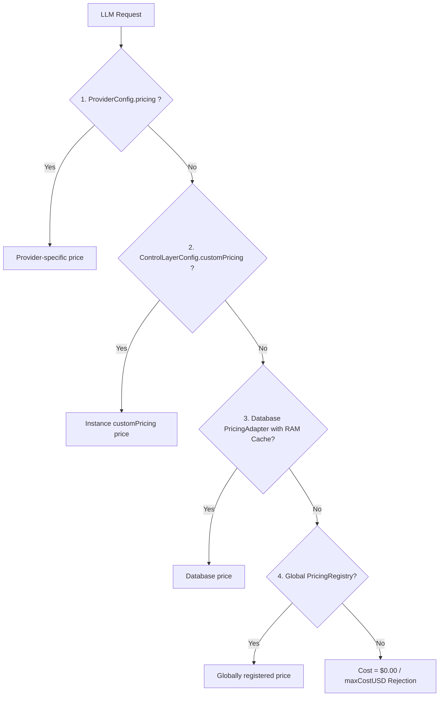

# 💰 Complete Pricing & FinOps Guide (`avantgate`)

> **Monitor, audit, and cap your LLM spend in real time without stale prices or invented estimates.**

---

## 🎯 Philosophy: "Strict & Truthful" (Zero Hardcoded Guesswork)

Unlike passive proxies that hardcode pricing snapshots from months ago:
- **AvantGate starts with an empty pricing registry by default**.
- **No fake or approximate costs**: If a model has no configured price, its tracked cost is `$0.00` (while token consumption is still recorded with 100% precision).
- **Pre-flight financial safety**: When enabling spend caps (`maxCostUSD: 0.01`), AvantGate strictly requires that model pricing is declared so it can block requests before any billable network call.

---

## 🛠️ The 4 Configuration Methods



---

### Method 1: Direct Declaration in Provider (Fastest)

Ideal for quick prototyping, lightweight scripts, or applying negotiated enterprise discount tiers:

```typescript
import { createAvantGate } from "avantgate";

const control = createAvantGate({
  primary: {
    provider: "deepseek",
    model: "deepseek-chat",
    apiKey: process.env.DEEPSEEK_API_KEY!,
    // 💡 Direct pricing per million tokens
    pricing: {
      promptUSDPerMillion: 0.14,
      completionUSDPerMillion: 0.28,
      cacheHitUSDPerMillion: 0.014, // Optional: discounted KV cache hit rate
    },
  },
  maxCostUSD: 0.005, // Blocks pre-flight if minimum input cost exceeds $0.005
});

const result = await control.execute({
  userQuery: "Generate executive summary...",
});

console.log(`Exact cost: $${result.costUSD.toFixed(6)}`);
```

---

### Method 2: Instance Pricing Grid (`customPricing`)

Ideal when your application routes queries across multiple models and distributor endpoints:

```typescript
import { createAvantGate } from "avantgate";

const control = createAvantGate({
  primary: { provider: "deepseek", model: "deepseek-chat", apiKey: process.env.DEEPSEEK_API_KEY! },
  fallback: { provider: "mistral", model: "mistral-small-latest", apiKey: process.env.MISTRAL_API_KEY! },

  customPricing: {
    // Simple key by model name
    "deepseek-chat": { promptUSDPerMillion: 0.14, completionUSDPerMillion: 0.28 },
    "mistral-small-latest": { promptUSDPerMillion: 0.20, completionUSDPerMillion: 0.60 },

    // Qualified key by distributor (e.g., via OpenRouter or Azure)
    "openrouter/anthropic/claude-3.5-sonnet": { promptUSDPerMillion: 3.00, completionUSDPerMillion: 15.00 },
    "azure/gpt-4o": { promptUSDPerMillion: 2.75, completionUSDPerMillion: 11.00 },
  },
});
```

---

### Method 3: Database Connection (`PricingAdapter` with RAM Cache)

This is **the recommended production architecture for multi-tenant SaaS applications (e.g. LexTalk)**.  
Your model pricing is stored in a SQL database (PostgreSQL, MySQL, SQLite) and managed via your internal admin dashboard.

#### A. Recommended Prisma Schema

```prisma
model ModelPricing {
  id                     String    @id @default(cuid())
  distributor            String    // "deepseek", "mistral", "openrouter", "openai", "azure"
  model                  String    // "deepseek-chat", "mistral-large-latest", "gpt-4o"
  promptPriceUSDPerM     Decimal   @db.Decimal(10, 4) // e.g. 0.1400
  completionPriceUSDPerM Decimal   @db.Decimal(10, 4) // e.g. 0.2800
  cacheHitPriceUSDPerM   Decimal?  @db.Decimal(10, 4) // e.g. 0.0140
  isActive               Boolean   @default(true)
  updatedAt              DateTime  @updatedAt

  @@unique([distributor, model])
}
```

#### B. Wiring into AvantGate with In-Memory Caching (0 ms Overhead)

```typescript
import { createAvantGate, type PricingAdapter } from "avantgate";
import { prisma } from "@/lib/prisma";

const control = createAvantGate({
  primary: { provider: "deepseek", model: "deepseek-chat", apiKey: process.env.DEEPSEEK_API_KEY! },

  // 💡 The adapter queries Prisma only on cache misses
  pricingAdapter: {
    async fetchPrice(model, provider) {
      const row = await prisma.modelPricing.findFirst({
        where: { model, distributor: provider, isActive: true },
      });
      if (!row) return undefined;

      return {
        promptUSDPerMillion: Number(row.promptPriceUSDPerM),
        completionUSDPerMillion: Number(row.completionPriceUSDPerM),
        cacheHitUSDPerMillion: row.cacheHitPriceUSDPerM ? Number(row.cacheHitPriceUSDPerM) : undefined,
      };
    },
  },

  // ⚡ In-memory cache TTL (5 minutes by default)
  pricingCacheTtlMs: 5 * 60 * 1000,
});
```

#### C. Hot-Cache Invalidation on Admin Updates

When an administrator updates a price in your web back-office:

```typescript
import { CachedPricingAdapter } from "avantgate";

// In your Next.js Server Action or Express API route:
export async function updateModelPrice(distributor: string, model: string, newPrompt: number, newCompletion: number) {
  await prisma.modelPricing.update({
    where: { distributor_model: { distributor, model } },
    data: { promptPriceUSDPerM: newPrompt, completionPriceUSDPerM: newCompletion },
  });

  // 💡 Immediately invalidate the RAM cache without restarting the app
  cachedPricingAdapter.invalidate(model, distributor);
}
```

---

### Method 4: Decoupled Global Registry (`PricingRegistry`)

You can also configure prices once at application bootstrap:

```typescript
import { PricingRegistry } from "avantgate";

// Register an individual model price
PricingRegistry.registerPrice("deepseek-chat", {
  promptUSDPerMillion: 0.14,
  completionUSDPerMillion: 0.28,
});

// Register prices for an entire distributor catalog
PricingRegistry.registerDistributorPrices("openrouter", {
  "deepseek/deepseek-chat": { promptUSDPerMillion: 0.14, completionUSDPerMillion: 0.28 },
  "anthropic/claude-3.5-sonnet": { promptUSDPerMillion: 3.00, completionUSDPerMillion: 15.00 },
});
```

---

## 📦 Reference Seed Dataset (`SEED_MODEL_PRICES`)

If you are initializing a new project and looking for a baseline catalog to seed your database, AvantGate exports `SEED_MODEL_PRICES`:

```typescript
import { SEED_MODEL_PRICES, PricingRegistry } from "avantgate";
import { prisma } from "@/lib/prisma";

// Example Prisma seed script (prisma/seed.ts)
async function seedPrices() {
  for (const [key, price] of Object.entries(SEED_MODEL_PRICES)) {
    const [distributor, ...modelParts] = key.includes("/") ? key.split("/") : ["direct", key];
    const model = modelParts.join("/") || key;

    await prisma.modelPricing.upsert({
      where: { distributor_model: { distributor, model } },
      create: {
        distributor,
        model,
        promptPriceUSDPerM: price.promptUSDPerMillion,
        completionPriceUSDPerM: price.completionUSDPerMillion,
      },
      update: {},
    });
  }
}
```

---

## 🛡️ Pre-Flight Budget Guard Mechanics (`maxCostUSD`)

When you specify `maxCostUSD`:

```typescript
const control = createAvantGate({
  primary: {
    provider: "deepseek",
    model: "deepseek-chat",
    apiKey: process.env.DEEPSEEK_API_KEY!,
    pricing: { promptUSDPerMillion: 0.14, completionUSDPerMillion: 0.28 },
  },
  maxCostUSD: 0.00005, // Very strict budget limit
});
```

AvantGate enforces a two-stage check:
1. **Pre-Flight Validation**: Estimates the minimum expected input cost (`promptTokens * promptUSDPerMillion / 1_000_000`). If this initial input cost exceeds `maxCostUSD`, the request is **rejected instantly with a `BudgetExceededError` before making any network call**.
2. **Post-Execution Validation**: After receiving the completion, validates that total actual cost respects the limit.
3. **Truth Requirement**: If `maxCostUSD` is enabled on a paid model without any registered price, AvantGate throws an explicit `ConfigurationError` rather than guessing a random price.
