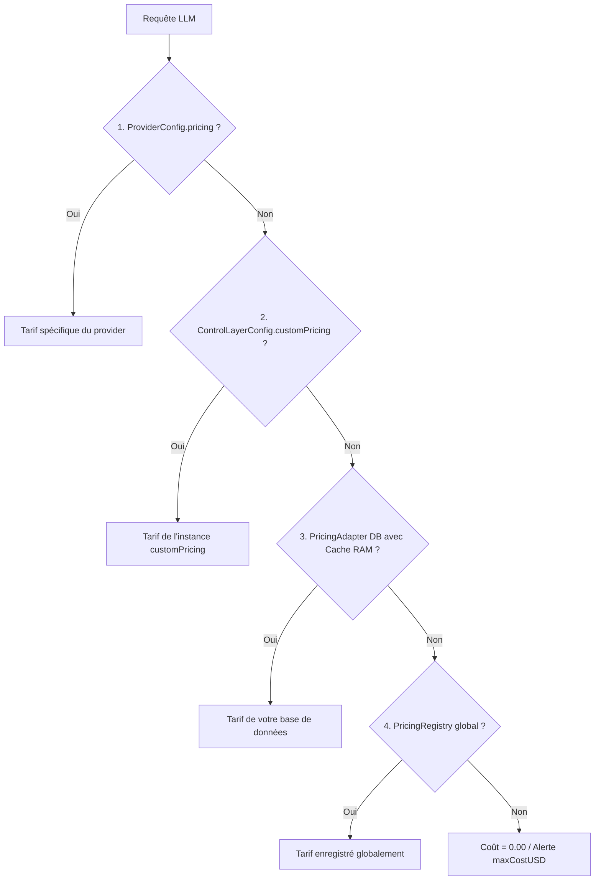

# 💰 Guide Complet de Tarification & FinOps (`avantgate`)

> **Maîtrisez et auditez vos coûts LLM en temps réel, sans chiffres inventés ni prix périmés.**

---

## 🎯 Philosophie : "Strict & Truthful" (Zéro Code en Dur)

Contrairement aux solutions passives qui codent en dur des snapshots de prix datant de plusieurs mois :
- **AvantGate démarre avec un registre tarifaire vide**.
- **Aucun prix approximatif n'est inventé** : si un modèle n'est pas configuré, son coût comptabilisé est de `$0.00` (les tokens consommés restant suivis avec une précision absolue).
- **Sécurité financière pré-vol** : si vous activez un plafond de dépense (`maxCostUSD: 0.01`), AvantGate exige que le tarif du modèle soit déclaré afin d'intercepter les requêtes avant de payer.

---

## 🛠️ Les 4 Méthodes de Configuration



---

### Méthode 1 : Déclaration Directe dans le Provider (Le plus rapide)

Idéal pour tester un modèle, pour des scripts légers, ou pour appliquer une remise entreprise négociée :

```typescript
import { createAvantGate } from "avantgate";

const control = createAvantGate({
  primary: {
    provider: "deepseek",
    model: "deepseek-chat",
    apiKey: process.env.DEEPSEEK_API_KEY!,
    // 💡 Déclaration directe par million de tokens
    pricing: {
      promptUSDPerMillion: 0.14,
      completionUSDPerMillion: 0.28,
      cacheHitUSDPerMillion: 0.014, // Optionnel : tarif réduit sur hit de cache KV
    },
  },
  maxCostUSD: 0.005, // Bloque pré-vol si le coût d'entrée dépasse $0.005
});

const result = await control.execute({
  userQuery: "Générer un bilan synthétique...",
});

console.log(`Coût exact : $${result.costUSD.toFixed(6)}`);
```

---

### Méthode 2 : Grille Tarifaire d'Instance (`customPricing`)

Idéal lorsque votre application utilise plusieurs modèles et distributeurs :

```typescript
import { createAvantGate } from "avantgate";

const control = createAvantGate({
  primary: { provider: "deepseek", model: "deepseek-chat", apiKey: process.env.DEEPSEEK_API_KEY! },
  fallback: { provider: "mistral", model: "mistral-small-latest", apiKey: process.env.MISTRAL_API_KEY! },

  customPricing: {
    // Clé simple par nom de modèle
    "deepseek-chat": { promptUSDPerMillion: 0.14, completionUSDPerMillion: 0.28 },
    "mistral-small-latest": { promptUSDPerMillion: 0.20, completionUSDPerMillion: 0.60 },

    // Clé qualifiée par distributeur (ex: via OpenRouter ou Azure)
    "openrouter/anthropic/claude-3.5-sonnet": { promptUSDPerMillion: 3.00, completionUSDPerMillion: 15.00 },
    "azure/gpt-4o": { promptUSDPerMillion: 2.75, completionUSDPerMillion: 11.00 },
  },
});
```

---

### Méthode 3 : Connexion Base de Données (`PricingAdapter` avec Cache RAM)

C'est **l'architecture recommandée pour les applications SaaS en production (ex: LexTalk)**.  
Vos prix sont stockés en base de données SQL (PostgreSQL, MySQL, SQLite) et administrables depuis votre back-office.

#### A. Schéma Prisma Recommandé

```prisma
model ModelPricing {
  id                     String    @id @default(cuid())
  distributor            String    // "deepseek", "mistral", "openrouter", "openai", "azure"
  model                  String    // "deepseek-chat", "mistral-large-latest", "gpt-4o"
  promptPriceUSDPerM     Decimal   @db.Decimal(10, 4) // ex: 0.1400
  completionPriceUSDPerM Decimal   @db.Decimal(10, 4) // ex: 0.2800
  cacheHitPriceUSDPerM   Decimal?  @db.Decimal(10, 4) // ex: 0.0140
  isActive               Boolean   @default(true)
  updatedAt              DateTime  @updatedAt

  @@unique([distributor, model])
}
```

#### B. Branchement dans AvantGate avec Cache Mémoire (0 ms Overhead)

```typescript
import { createAvantGate, type PricingAdapter } from "avantgate";
import { prisma } from "@/lib/prisma";

const control = createAvantGate({
  primary: { provider: "deepseek", model: "deepseek-chat", apiKey: process.env.DEEPSEEK_API_KEY! },

  // 💡 L'adaptateur interroge Prisma uniquement en cas de cache-miss
  pricingAdapter: {
    async fetchPrice(model, provider) {
      const row = await prisma.modelPricing.findFirst({
        where: { model, distributor: provider, isActive: true },
      });
      if (!row) return undefined;

      return {
        promptUSDPerMillion: Number(row.promptPriceUSDPerM),
        completionUSDPerMillion: Number(row.completionPriceUSDPerM),
        cacheHitUSDPerMillion: row.cacheHitPriceUSDPerM ? Number(row.cacheHitPriceUSDPerM) : undefined,
      };
    },
  },

  // ⚡ Durée de validité du cache en mémoire (5 minutes par défaut)
  pricingCacheTtlMs: 5 * 60 * 1000,
});
```

#### C. Invalidation du Cache lors d'une Modification en Back-Office

Si un administrateur met à jour un tarif dans votre interface web :

```typescript
import { CachedPricingAdapter } from "avantgate";

// Dans votre Server Action ou route API Next.js / Express :
export async function updateModelPrice(distributor: string, model: string, newPrompt: number, newCompletion: number) {
  await prisma.modelPricing.update({
    where: { distributor_model: { distributor, model } },
    data: { promptPriceUSDPerM: newPrompt, completionPriceUSDPerM: newCompletion },
  });

  // 💡 Invalider immédiatement le cache mémoire sans redémarrer l'application
  cachedPricingAdapter.invalidate(model, distributor);
}
```

---

### Méthode 4 : Registre Global Découplé (`PricingRegistry`)

Vous pouvez également initialiser les tarifs une seule fois au bootstrap de votre application :

```typescript
import { PricingRegistry } from "avantgate";

// Enregistrer un modèle unique
PricingRegistry.registerPrice("deepseek-chat", {
  promptUSDPerMillion: 0.14,
  completionUSDPerMillion: 0.28,
});

// Enregistrer les tarifs d'un distributeur entier
PricingRegistry.registerDistributorPrices("openrouter", {
  "deepseek/deepseek-chat": { promptUSDPerMillion: 0.14, completionUSDPerMillion: 0.28 },
  "anthropic/claude-3.5-sonnet": { promptUSDPerMillion: 3.00, completionUSDPerMillion: 15.00 },
});
```

---

## 📦 Jeu de Données Initial Indicatif (`SEED_MODEL_PRICES`)

Si vous initialisez votre projet et cherchez un catalogue de référence pour peupler votre base de données, AvantGate exporte `SEED_MODEL_PRICES` :

```typescript
import { SEED_MODEL_PRICES, PricingRegistry } from "avantgate";
import { prisma } from "@/lib/prisma";

// Exemple de script de Seed Prisma (prisma/seed.ts)
async function seedPrices() {
  for (const [key, price] of Object.entries(SEED_MODEL_PRICES)) {
    const [distributor, ...modelParts] = key.includes("/") ? key.split("/") : ["direct", key];
    const model = modelParts.join("/") || key;

    await prisma.modelPricing.upsert({
      where: { distributor_model: { distributor, model } },
      create: {
        distributor,
        model,
        promptPriceUSDPerM: price.promptUSDPerMillion,
        completionPriceUSDPerM: price.completionUSDPerMillion,
      },
      update: {},
    });
  }
}
```

---

## 🛡️ Fonctionnement du Plafond Pré-Vol (`maxCostUSD`)

Lorsque vous spécifiez `maxCostUSD` :

```typescript
const control = createAvantGate({
  primary: {
    provider: "deepseek",
    model: "deepseek-chat",
    apiKey: process.env.DEEPSEEK_API_KEY!,
    pricing: { promptUSDPerMillion: 0.14, completionUSDPerMillion: 0.28 },
  },
  maxCostUSD: 0.00005, // Budget très serré
});
```

AvantGate effectue un double contrôle :
1. **Contrôle Pré-Vol** : estime le coût d'entrée minimal attendu (`promptTokens * promptUSDPerMillion / 1_000_000`). Si ce coût d'entrée dépasse `maxCostUSD`, la requête est **rejetée instantanément avec une `BudgetExceededError` sans aucun appel réseau**.
2. **Contrôle Post-Exécution** : après réception de la complétion, vérifie que le coût réel total respecte le plafond.
3. **Exigence de Vérité** : si `maxCostUSD` est activé sur un modèle payant sans aucun tarif configuré, AvantGate lève une `ConfigurationError` explicite plutôt que de deviner un prix au hasard.
