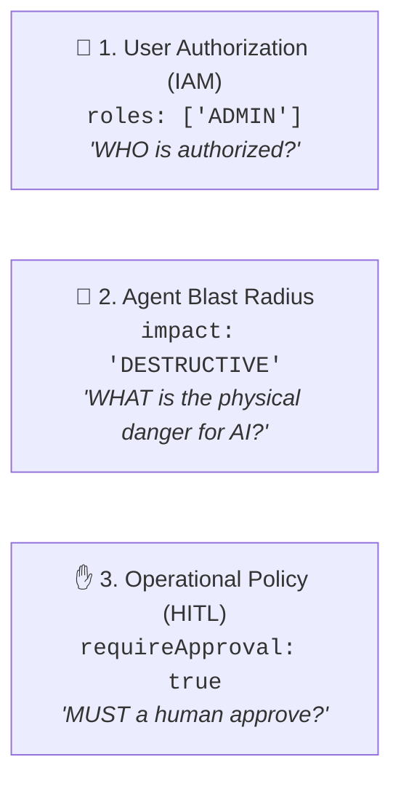

# 🚀 AvantGate v1.3.0 — Release Notes

> **Release Date**: September 20, 2026  
> **NPM Package**: [`avantgate@1.3.0`](https://www.npmjs.com/package/avantgate)  
> **Release Type**: Minor / Feature Release — Tool Impact Governance (`READ_ONLY`, `MUTATIVE`, `DESTRUCTIVE`), The Golden Triad Architecture, Impact-Based Agent Confinement & Dynamic JSON Deep-DLP

---

## 📌 Executive Summary

The **v1.3.0** release of AvantGate establishes the **Golden Triad of Tool Governance**, introducing objective side-effect profiling (`impact`), native safe-by-default execution guards, dedicated strategies for impact-based agent confinement, and deep recursive inspection for unstructured JSON blobs.

1. **Objective Side-Effect Profiling (`impact: ToolImpact`)**: Classifies tools by their physical effect on the world (`"READ_ONLY"`, `"MUTATIVE"`, `"DESTRUCTIVE"`), moving from arbitrary role conventions to objective technical contracts.
2. **Safe-by-Default Protection (`requireApproval`)**: Tools default to `"READ_ONLY"`. Any tool designated as `"DESTRUCTIVE"` automatically enables `requireApproval: true` to enforce human-in-the-loop validation before execution.
3. **Agent Confinement Strategies**:
   - `ReadOnlyToolStrategy`: Mathematically guarantees that observation and inspection workflows only receive non-mutative tools.
   - `MaxImpactToolStrategy`: Caps the maximum allowed blast radius for autonomous agents.
   - `AccessControlToolStrategy`: Evaluates allowed business domains, user roles, and `maxImpact` ceilings in a single pass.
4. **The Golden Triad Architecture & Clean KISS Refactor**:
   - Separates User IAM (`roles`), AI Blast Radius (`impact`), and Operational Policy (`requireApproval`).
   - Completely removes redundant `permissions` fields, eliminating the "Double-RBAC" anti-pattern in favor of clean, idiomatic role-based access control.
5. **Defense-in-Depth: In-Flight Recursive DLP for Dynamic JSON (`Record<string, unknown>`)**:
   - Bridges the boundary between compile-time static schemas (`dto.exhaustivePick`) and unstructured runtime data (`jsonb`, metadata dictionaries) via recursive deep traversal.
6. **Enriched Registry & Headless Export**:
   - Added `registry.getByImpact()` and impact-aware descriptor exports (`registry.getDescriptors({ impact: "DESTRUCTIVE" })`).

---

## 🔍 Detailed Features & Code Examples

### 1. 🛡️ The Golden Triad of Tool Governance

To prevent overlapping security concepts, AvantGate v1.3.0 establishes three distinct, complementary dimensions:



```typescript
import { createIsolatedTool } from "avantgate/agent";
import { z } from "zod";

export const deleteAccountTool = createIsolatedTool({
  name: "delete_account",
  domain: "crm",
  resource: "accounts",
  
  // 1. User Authorization (IAM)
  roles: ["ADMIN"],

  // 2. Physical Impact Profile (AI Confinement)
  impact: "DESTRUCTIVE",

  // 3. Human-in-the-Loop (Auto-enabled for DESTRUCTIVE tools)
  requireApproval: true,

  parameters: z.object({ accountId: z.string() }),
  async execute(args) {
    return await db.accounts.delete({ where: { id: args.accountId } });
  },
});
```

---

### 2. 🛡️ Impact-Based Agent Confinement (`ReadOnlyToolStrategy` & `MaxImpactToolStrategy`)

Workflows can strictly confine agent execution capabilities using mathematical impact guarantees:

```typescript
import {
  ToolRegistry,
  ReadOnlyToolStrategy,
  MaxImpactToolStrategy,
  AccessControlToolStrategy,
} from "avantgate/agent";

const registry = new ToolRegistry();
registry.registerMany([getOrderTool, updateProfileTool, deleteAccountTool]);

// 🔍 1. Pure Read-Only Inspection (Strictly Non-Mutative)
// Guaranteed to receive ZERO mutative tools, even if invoked by a Super-Admin!
const readOnlyStrategy = new ReadOnlyToolStrategy();
const inspectionTools = readOnlyStrategy.selectTools(registry.getAll(), {});

// ⚡ 2. Autonomous Safe Execution (Capped at MUTATIVE, excluding DESTRUCTIVE)
const safeStrategy = new MaxImpactToolStrategy("MUTATIVE");
const autonomousTools = safeStrategy.selectTools(registry.getAll(), {});

// 🏢 3. Unified Access Control (Domain + Role + Max Impact)
const salesStrategy = new AccessControlToolStrategy({
  allowedDomains: ["crm"],
  maxImpact: "MUTATIVE",
});
const salesTools = salesStrategy.selectTools(registry.getAll(), { role: "SALES" });
```

---

### 3. 🔒 Defense-in-Depth: Recursive DLP for Dynamic JSON Blobs

While `dto.exhaustivePick` stops schema drift on known columns at compile-time, unstructured data (`metadata: Record<string, unknown>`) cannot be statically enumerated. AvantGate's recursive DLP engine deep-scans nested structures at runtime:

```typescript
export const getTicketTool = createIsolatedTool({
  name: "get_ticket",
  parameters: z.object({ ticketId: z.string() }),
  async execute(args) {
    return {
      id: args.ticketId,
      status: "OPEN",
      // Unstructured JSON containing nested PII
      metadata: {
        agentNotes: "Callback at 06 12 34 56 78 or support@client.fr",
        billing: { ibanProvided: "FR76 3000 6000 0112 3456 7890 189" },
      },
    };
  },
  // Layer 1: Compile-time whitelist on known properties
  llmDto: dto.exhaustivePick<TicketEntity>()({
    keep: ["id", "status", "metadata"],
    drop: ["internalRoutingTag"],
  }),
  // Layer 2: Recursive deep-scan redacts PII inside nested metadata
  sanitizePii: true,
});
```

#### Output delivered to LLM:
```json
{
  "id": "TCK-104",
  "status": "OPEN",
  "metadata": {
    "agentNotes": "Callback at [REDACTED_PHONE] or [REDACTED_EMAIL]",
    "billing": { "ibanProvided": "[REDACTED_IBAN]" }
  }
}
```

---

### 4. 🗄️ Registry & Headless Descriptor Filtering

```typescript
// Filter registered tools by impact
const safeTools = registry.getByImpact("READ_ONLY");
const dangerousTools = registry.getByImpact("DESTRUCTIVE");

// Export headless descriptors for UI/Console dashboards
const descriptors = registry.getDescriptors({
  domain: "crm",
  role: "ADMIN",
  impact: "DESTRUCTIVE",
});
// Returns: [{ id, name, domain, resource, roles, impact, requireApproval, tags }]
```

---

## 🔄 Breaking Changes & Migration Guide

### ⚠️ Removal of `permissions` Field (Clean KISS)
In v1.3.0, the redundant `permissions` property has been removed from `IsolatedToolConfig`, `RegisteredTool`, `ToolDescriptor`, and `ToolContext`.

#### Migration:
```diff
 createIsolatedTool({
   name: "delete_lead",
   domain: "crm",
   resource: "prospects",
   roles: ["ADMIN"],
-  permissions: ["crm:delete"],
+  impact: "DESTRUCTIVE",
 });
```

---

## 🧪 Verification & Test Coverage

- **100% Pass** across 12 test suites (Core, Agent, Finance, Governance, Impact).
- **TypeScript**: 0 compilation errors (`tsc --noEmit`).
- **Build**: Full ESM, CJS, and `.d.ts` bundles generated.
