# 🚀 AvantGate v1.5.0 — Release Notes

> **Release Date**: September 23, 2026  
> **NPM Package**: [`avantgate@1.5.0`](https://www.npmjs.com/package/avantgate)  
> **Release Type**: Minor / Feature Release — Business Short-Circuit & Graceful Abort (`ctx.abort()`), Zero-Rollback Data Preservation, Sentinel Exception Pattern & ES6 Arrow Functions Refactor

---

## 📌 Executive Summary

The **v1.5.0** release resolves a fundamental architectural challenge in multi-step AI orchestrations: **the binary dilemma between total success and destructive Saga rollback**.

In real-world agent operations (CRM automation, sales prospecting pipelines like `prospectAI`, fintech, and KYC), operations frequently disqualify or short-circuit without being technical crashes. **AvantGate v1.5.0** introduces first-class **Graceful Abort (`ctx.abort()`)** support to the deterministic workflow state machine:

1. **Graceful Abort (`ctx.abort(reason, payload)`)**: Allows any workflow step to halt execution immediately upon encountering an expected business disqualification (e.g., prospect opted out, duplicate subscription detected, below risk score) without throwing a fatal application error.
2. **Zero Saga Rollback on Business Short-Circuit**: Unlike technical exceptions (`throw Error`), calling `ctx.abort()` triggers **zero compensation handlers**. All previously completed steps (such as immutable compliance audits or CRM identity verifications) remain permanently intact.
3. **Guaranteed Immediate Halt (Sentinel Pattern)**: Implemented via an internal `WorkflowAbortSignal` sentinel error. Step execution stops immediately on that exact line with mathematical certainty, eliminating subtle bugs caused by forgotten `return` statements.
4. **Safe Output Resolution (Anti-Crash Guard)**: Aborted runs automatically resolve their output to the abort `payload` (or `{ aborted: true, reason }`), preventing `outputDto` projection closures from crashing with `TypeError` when referencing unexecuted future steps.
5. **Continuous Agent Conversations (`asTool()`)**: When exposed to LLMs via `.asTool()`, an aborted workflow returns a clean structured payload instead of a crashing tool exception. The agent seamlessly explains the reason and proposes alternative recommendations to the user.
6. **ES6 Arrow Functions Standard**: The `avantgate/workflow` engine has been refactored to strict arrow function constants, guaranteeing lexical scope safety and aligning with enterprise Clean Code standards.

---

## 🏛️ Architectural Context: Technical Crash vs. Business Short-Circuit

```mermaid
flowchart TD
    subgraph SAGA_FAIL["❌ Technical Crash (Unhandled Error)"]
        A1["Step 1: Enrich Lead<br/>(COMPLETED)"] --> A2["Step 2: Check External API<br/>(NETWORK TIMEOUT / HTTP 500)"]
        A2 -.->|"Triggers Saga Rollback<br/>(Destructive Undo)"| R1["Rollback Step 1<br/>(Compensate: Deletes Valid Data!)"]
        R1 --> ERR["Throw WorkflowSagaRollbackError<br/>Tool Crash in LLM Context"]
    end

    subgraph GRACEFUL_ABORT["✅ Business Short-Circuit (ctx.abort)"]
        B1["Step 1: Enrich Lead<br/>(COMPLETED)"] --> B2["Step 2: Verify Eligibility<br/>(Prospect already subscribed / Opt-out)"]
        B2 -->|"ctx.abort('ALREADY_SUBSCRIBED')<br/><b>ZERO Rollback</b>"| ABORT["Workflow Status: ABORTED<br/>Step 1 Remains Intact"]
        ABORT --> AI["Structured Payload delivered to LLM<br/>Agent proposes Upsell / Alternate offer"]
    end
```



---

## 🔍 Detailed Features & Code Examples

### 1. 🛑 Using `ctx.abort()` in Multi-Step Workflows

```typescript
import { defineWorkflow } from "avantgate/workflow";
import { z } from "zod";

export const salesOutreachWorkflow = defineWorkflow({
  name: "sales_outreach",
  description: "Dispatches personalized sales email and schedules CRM follow-up",
  impact: "MUTATIVE",
  roles: ["SALES_REP"],

  inputSchema: z.object({
    prospectId: z.string(),
    campaignId: z.string(),
  }),

  steps: [
    {
      name: "verify_prospect",
      async execute(input, ctx) {
        const prospect = await crm.findProspect(input.prospectId);

        // Operational Short-Circuit: GDPR opt-out or missing prospect
        if (!prospect || prospect.optOut) {
          ctx.abort("PROSPECT_NOT_ELIGIBLE", {
            prospectId: input.prospectId,
            reason: prospect?.optOut ? "GDPR_OPTOUT" : "NOT_FOUND",
            message: "Prospect is either missing or opted out of sales communications.",
            suggestedAction: "search_by_email_or_create",
          });
        }

        return { prospect };
      },
      async compensate(input, ctx) {
        // Only invoked on technical crashes, NEVER on ctx.abort()!
        await crm.rollbackVerification(input.prospectId);
      },
    },
    {
      name: "send_sales_email",
      async execute(input, ctx) {
        // Guaranteed NOT to execute if step 1 aborted!
        const { prospect } = ctx.getStepResult("verify_prospect");
        return await mailer.sendSalesEmail(prospect.email);
      },
    },
    {
      name: "schedule_crm_task",
      async execute(input, ctx) {
        return await crm.scheduleTask(input.prospectId, "Follow-up in 3 days");
      },
    },
  ],

  outputDto: (result) => ({
    success: result.status === "COMPLETED",
    details: result.stepResults,
  }),
});
```

---

### 2. ⚡ Executing & Handling Aborted Workflows

When running the workflow directly, `executeWorkflow()` resolves with `status: "ABORTED"`:

```typescript
const result = await salesOutreachWorkflow.run({
  prospectId: "prospect_opted_out_999",
  campaignId: "q4_enterprise",
});

if (result.status === "ABORTED") {
  console.log("Workflow halted gracefully:", result.abortReason);
  // Output: "PROSPECT_NOT_ELIGIBLE"
  
  console.log("Abort payload:", result.abortPayload);
  // Output: { prospectId: "...", reason: "GDPR_OPTOUT", ... }
  
  console.log("Output adopted abort payload:", result.output);
  // Output: { prospectId: "...", reason: "GDPR_OPTOUT", ... }
}
```

---

### 3. 🤖 Natural LLM Conversation Continuity (`asTool()`)

When converted to an agent tool via `.asTool()`, an aborted workflow completes cleanly:

```typescript
import { ToolRegistry } from "avantgate/agent";

const tool = salesOutreachWorkflow.asTool();
const toolResult = await tool.execute({
  prospectId: "prospect_404",
  campaignId: "inbound_web",
});

// toolResult is returned directly to the LLM context:
// {
//   workflowId: "sales_outreach",
//   status: "ABORTED",
//   abortReason: "PROSPECT_NOT_ELIGIBLE",
//   abortPayload: { ... }
// }
```

**Agent Response to End User:**
> *"I noticed that this prospect has opted out of marketing communications under GDPR. I have skipped sending the email and scheduling the task. Would you like me to create an internal compliance review ticket instead?"*

---

### 4. 🛡️ Signal Introspection & Type Utilities

For advanced telemetry and custom middleware, AvantGate exports helper utilities:

```typescript
import { WorkflowAbortSignal, isWorkflowAbortSignal } from "avantgate/workflow";

try {
  // Custom execution harness
} catch (error) {
  if (isWorkflowAbortSignal(error)) {
    console.warn(`Interrupted by step abort: ${error.reason}`);
    console.log(error.payload);
  }
}
```

---

## 📋 Summary of Changes

| Component | Nature | Description |
| :--- | :--- | :--- |
| `src/workflow/types.ts` | **Feature** | Added `abort<T>(reason, payload): never` to `WorkflowStepContext`. Added `"ABORTED"` to `WorkflowExecutionResult['status']`. |
| `src/agent/types.ts` | **Enhancement** | Added `"ABORTED"` status to `StepStatus` union type. |
| `src/workflow/engine.ts` | **Feature** | Added Sentinel interception, zero-rollback bypass, safe output resolution fallback, and persistence storage updates (`updateStepStatus(..., "ABORTED")`). |
| `src/workflow/errors.ts` | **Feature** | Created `WorkflowAbortSignal` class and `isWorkflowAbortSignal()` type guard. |
| `src/workflow/index.ts` | **Exports** | Exported `WorkflowAbortSignal` and `isWorkflowAbortSignal`. |
| `src/workflow/` | **Refactor** | Migrated all functions to ES6 Arrow Function constants. |
| `docs/workflow.md` | **Documentation** | Added Chapter 5 covering Functional Graceful Abort, Use Cases, and Mermaid architecture diagrams. |
| `tests/workflow/` | **Tests** | Added exhaustive test suite in `tests/workflow/workflow-abort.test.ts`. |

---

## 🔄 Migration & Compatibility

- **100% Backward Compatible**: Existing workflows built for `v1.4.0` continue to run without any modifications.
- **Zero Breaking Changes**: `ctx.abort()` is an additive primitive on `WorkflowStepContext`.
- **Safe Output Fallback**: Workflows using existing `outputDto` handlers automatically handle aborted runs safely.

---

## 🧪 Verification & Quality Assurance

- **100% Passing Tests**: All 16 unit and integration test suites pass successfully:
  ```powershell
  npm test
  ```
- **TypeScript Strict Checking**: 0 errors found:
  ```powershell
  npm run lint
  ```
- **Production Bundles**: ESM, CJS, and `.d.ts` builds cleanly generated in `dist/`:
  ```powershell
  npm run build
  ```
