# 🚀 AvantGate v1.6.0 — Release Notes

> **Release Date**: September 23, 2026  
> **NPM Package**: [`avantgate@1.6.0`](https://www.npmjs.com/package/avantgate)  
> **Release Type**: Minor / Feature Release — Official Front-End Subpath Export (`avantgate/client`), Framework-Agnostic Universal Telemetry Client (`createAvantGateClient`), Optimized React Hook (`useAvantGateTelemetry`), Zero-Egress Client Security Guardrails & GateWall Dual-Channel Integration

---

## 📌 Executive Summary

The **v1.6.0** release marks a major milestone in AvantGate's mission to provide comprehensive AI application security and auditability: **unifying Front-End client observation with Back-End agent governance**.

Until now, AI observability platforms have suffered from a critical blindspot: **client-side events**. When users paste confidential API keys (`sk-...`) or malicious prompt injections into chat interfaces, local in-browser guardrails block the request *before any network departure* (*Zero-Egress*). Consequently, backend servers never receive these events, leaving security officers and compliance dashboards completely blind to client-side threat attempts.

**AvantGate v1.6.0** introduces the official **`avantgate/client`** subpath export:

1. **Ultra-Lightweight Footprint (< 2 KB gzipped)**: Zero infrastructure dependencies, pure browser-native `fetch`, ensuring instant loading in production single-page applications.
2. **Framework-Agnostic Universal Client (`createAvantGateClient`)**: First-class support for modern front-end tooling including **Vite** (Vanilla JS, TypeScript, Vue 3, Svelte, SolidJS, Angular), Next.js, and global state stores (Zustand, Redux).
3. **Production React Hook (`useAvantGateTelemetry`)**: Engineered with strict `useRef` instance isolation, automated `useEffect` cleanup, and `useCallback` / `useMemo` reference stability to guarantee zero unnecessary component re-renders.
4. **Guaranteed Delivery & Keepalive Transport**: Standardized exclusively on `fetch(..., { keepalive: true })`, bypassing the authentication header limitations of `navigator.sendBeacon` and ensuring event dispatch during tab closes (`beforeunload`) or tab switching (`visibilitychange`).
5. **GateWall Dual-Channel Correlation (`runId`)**: Enables seamless end-to-end Session Replays by reconciling client-side threat alerts (`CLIENT_SECURITY_ALERT`), UI render metrics (`CLIENT_DATA_RENDERED`), and user sentiment (`USER_FEEDBACK`) with backend agent tool spans and token FinOps metrics.
6. **Strict Privilege Scoping (`gw_pub_...`)**: Safely exposes public client keys in browser bundles with ingest-only access permissions, strictly forbidding access to internal SaaS management APIs.

---

## 🏛️ Architectural Context: Single-Sided Blindspot vs. Dual-Channel Observability

```mermaid
flowchart TD
    subgraph SINGLE_SIDED["❌ Legacy Single-Sided Observability (Backend Only)"]
        U1["User pastes API Key (sk-...)"] --> G1["Client Guard blocks prompt (Zero-Egress)"]
        G1 -.->|"0 HTTP Requests sent to Backend"| BE1["Backend Agent Engine"]
        BE1 --> LOG1["Console Log: 0 Security Alerts<br/><b>Security Officer is Blind!</b>"]
    end

    subgraph DUAL_CHANNEL["✅ AvantGate v1.6.0 Dual-Channel Observability (DESIGN-019)"]
        U2["User pastes API Key (sk-...)"] --> G2["Client Guard blocks prompt (Zero-Egress)"]
        G2 -->|"POST /api/v1/ingest/events (gw_pub_...)<br/>CLIENT_SECURITY_ALERT"| GW["gateWall Control Plane"]
        
        U3["User sends valid prompt"] --> BE2["avantgate/agent (Node.js Engine)"]
        BE2 -->|"POST /api/v1/ingest/events (ag_sec_...)<br/>STEP_COMPLETED & TOOL_EXECUTION"| GW
        
        GW --> REPLAY["Timeline Correlator (runId)<br/><b>Full 360° Session Replay</b>"]
    end
```



---

## 🔍 Detailed Features & Code Examples

### 1. 🌐 Universal Framework-Agnostic Client (`createAvantGateClient`)

For applications built with **Vite** (Vanilla JS, TypeScript, Vue 3, Svelte, SolidJS) or non-React frontends:

```typescript
import { createAvantGateClient } from "avantgate/client";

// Initialize universal client (zero React dependency)
export const telemetry = createAvantGateClient({
  publicKey: import.meta.env.VITE_GATEWALL_PUBLIC_KEY,
  endpoint: "https://gatewall.company.com/api/v1/ingest/events",
  agentName: "prospect-qualifier",
  runId: "run_01j7xyz9abc",
});

// 1. Intercept prompt before sending to LLM API
const handlePromptSubmit = (promptText: string) => {
  if (/sk-[a-zA-Z0-9]{20,}/.test(promptText)) {
    telemetry.trackSecurityAlert("SUSPECTED_SECRET_INPUT", {
      inputLength: promptText.length,
      snippet: promptText.slice(0, 15) + "...",
    });
    alert("Security Notice: API key blocked before network transmission!");
    return;
  }
};

// 2. Track UI render counts
telemetry.trackClientDataRendered("prospect_table", {
  renderedItemCount: 15,
  channel: "STREAM",
});

// 3. Track user sentiment
telemetry.trackFeedback({
  rating: "POSITIVE",
  tag: "HELPFUL",
  comment: "Prospect qualifications were very accurate.",
});
```

---

### 2. ⚛️ Optimized React Hook (`useAvantGateTelemetry`)

Designed specifically for **React 18 & React 19** applications (Next.js, Vite React). Fully memorized with `useCallback` and `useMemo`:

```tsx
import React, { useState } from "react";
import { useAvantGateTelemetry } from "avantgate/client";

export const ProspectChat = ({ runId }: { runId: string }) => {
  const [prompt, setPrompt] = useState("");

  // All hooks (useRef, useEffect cleanup, useCallback, useMemo) handled in 1 line:
  const { trackSecurityAlert, trackClientDataRendered, trackFeedback } = useAvantGateTelemetry({
    publicKey: process.env.NEXT_PUBLIC_GATEWALL_PUBLIC_KEY!,
    endpoint: "https://gatewall.company.com/api/v1/ingest/events",
    agentName: "prospect-qualifier",
    runId,
  });

  const onSubmit = () => {
    // Pre-flight prompt inspection
    if (/ignore all previous instructions/i.test(prompt)) {
      trackSecurityAlert("POTENTIAL_PROMPT_INJECTION", {
        inputLength: prompt.length,
        snippet: prompt.slice(0, 30),
      });
      alert("Guardrail Triggered: System prompt override attempt detected.");
      return;
    }
  };

  return (
    <div className="chat-container">
      <input value={prompt} onChange={(e) => setPrompt(e.target.value)} />
      <button onClick={onSubmit}>Send</button>

      <div className="feedback-bar">
        <button onClick={() => trackFeedback({ rating: "POSITIVE", tag: "HELPFUL" })}>
          👍 Useful
        </button>
        <button onClick={() => trackFeedback({ rating: "NEGATIVE", tag: "INACCURATE" })}>
          👎 Inaccurate
        </button>
      </div>
    </div>
  );
};
```

---

### 3. 📦 Package Exports & Build Footprint

AvantGate v1.6.0 updates `package.json` to expose `./client` as an isolated entrypoint:

```json
{
  "name": "avantgate",
  "version": "1.6.0",
  "exports": {
    ".": {
      "types": "./dist/index.d.ts",
      "import": "./dist/index.mjs",
      "require": "./dist/index.js"
    },
    "./client": {
      "types": "./dist/client/index.d.ts",
      "import": "./dist/client/index.mjs",
      "require": "./dist/client/index.js"
    },
    "./agent": {
      "types": "./dist/agent/index.d.ts",
      "import": "./dist/agent/index.mjs",
      "require": "./dist/agent/index.js"
    },
    "./finance": {
      "types": "./dist/finance/index.d.ts",
      "import": "./dist/finance/index.mjs",
      "require": "./dist/finance/index.js"
    },
    "./workflow": {
      "types": "./dist/workflow/index.d.ts",
      "import": "./dist/workflow/index.mjs",
      "require": "./dist/workflow/index.js"
    }
  },
  "peerDependencies": {
    "react": ">=18.0.0"
  },
  "peerDependenciesMeta": {
    "react": {
      "optional": true
    }
  }
}
```

#### Size & Performance Benchmark:
- **Raw Bundle**: `6.53 KB`
- **Gzipped Bundle**: **`1.91 KB`** (exceeds the sub-3 KB target by 36%)
- **Zero Server-Side Footprint**: Node.js backends importing `avantgate` or `avantgate/agent` are not required to install `react`.

---

## 🛡️ Telemetry Event Taxonomy Reference

| Event Type | Source | Required Attributes | Purpose |
|---|---|---|---|
| **`CLIENT_SECURITY_ALERT`** | Front-End (`avantgate/client`) | `alertType`, `inputLength`, `snippet`, `timestamp` | Audit pre-flight blocked prompt injections, API key leaks, or unredacted PII before network transmission. |
| **`CLIENT_DATA_RENDERED`** | Front-End (`avantgate/client`) | `toolId`, `renderedItemCount`, `channel`, `timestamp` | Verify UI rendering integrity (detect empty renders, stream drops, or socket disconnects). |
| **`USER_FEEDBACK`** | Front-End (`avantgate/client`) | `rating`, `feedbackTag`, `userComment`, `timestamp` | Correlate user satisfaction scores directly with agent run IDs and FinOps token expenditure. |
| **`STEP_*` / `TOOL_EXECUTION`** | Back-End (`avantgate/agent`) | `stepName`, `toolId`, `durationMs`, `tokens`, `costUsd` | Trace durable multi-step state machines, tool access policies, and execution latency. |

---

## 🔄 Migration & Compatibility

- **100% Backward Compatible**: Existing imports from `avantgate`, `avantgate/agent`, `avantgate/workflow`, and `avantgate/finance` remain unchanged.
- **Node.js Compatibility**: v18.0.0, v20.0.0, v22.0.0+.
- **Browser Compatibility**: All modern browsers supporting `fetch(..., { keepalive: true })` (Chrome 66+, Firefox 63+, Safari 13+, Edge 79+).
- **React Compatibility**: React 18 and React 19 (optional peer dependency).

---

## ✅ Quality & Verification Summary

- [x] **Unit & Integration Tests**: 100% pass rate across core guardrails, agent harness, deterministic workflows, graceful abort, and browser telemetry.
- [x] **Type Safety**: Zero TypeScript compiler warnings (`tsc --noEmit`).
- [x] **Clean Architecture**: Strict adherence to YAGNI, KISS, DRY, and Arrow Functions.
- [x] **Packaging Validation**: Verified with `npm pack --dry-run` and clean tarball generation (`avantgate-1.6.0.tgz`).
