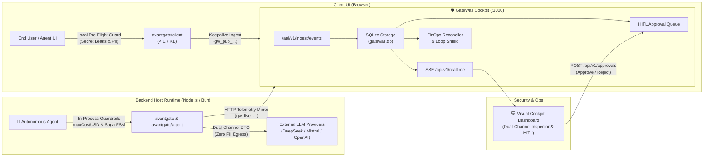

# 🚀 AvantGate v1.6.1 — Release Notes

> **Release Date**: September 24, 2026  
> **NPM Package**: [`avantgate@1.6.1`](https://www.npmjs.com/package/avantgate)  
> **Release Type**: Feature & Control Plane Release — Self-Hosted GateWall Cockpit (`gatewall/`), Single-Command Docker Compose Deployment (`:3000`), End-to-End Autonomous Agent Verification Suite, FinOps Fallback Cost Architecture, and Clean Code Monorepo Hardening

---

## 📌 Executive Summary

The **v1.6.1** release elevates the AvantGate ecosystem from an in-process AI Application Firewall (AI-WAF) library to a **complete, self-hosted, full-stack governance and compliance platform**.

While `avantgate` continues to provide sub-millisecond, zero-infrastructure defense inside your application process, developers now have access to **GateWall Cockpit** (`gatewall/`): a modern, self-hosted visual control plane, real-time telemetry inspector, and Human-in-the-Loop (HITL) approval dashboard built with **Next.js 16**, **React 19**, **Tailwind CSS v4**, and embedded **SQLite**.

### Key Highlights of v1.6.1:

1. **🖥️ Integrated GateWall Cockpit (`gatewall/`)**:
   - **Dual-Channel PII Inspector**: Visual side-by-side comparison of local escrow records (`rawPayload`) against redacted LLM summaries (`llmDto`), auditing zero data egress with live entropy and regex indicators.
   - **Human-in-the-Loop (HITL) Approval Queue**: Intercepts critical tool executions (`WAITING_APPROVAL`) in real time, enabling managers to inspect parameters and click **Approve** or **Reject**.
   - **Real-Time Streaming (SSE)**: Server-Sent Events (`/api/v1/realtime`) stream agent spans, security alerts, and render events dynamically without manual page refresh.
   - **Zero-External-Database SQLite Persistence**: Completely standalone storage in `/app/data/gatewall.db` without requiring PostgreSQL, ClickHouse, or Redis clusters.

2. **🐳 Single-Command Docker Compose Deployment**:
   - Centralized root `docker-compose.yml` exposing the complete cockpit on **`http://localhost:3000`** with embedded health checks and persistent volume storage.
   - Added npm convenience scripts in root `package.json` (`npm run gatewall:docker`, `npm run gatewall`, `npm run gatewall:build`).

3. **💰 FinOps Cost Architecture Formalization**:
   - Cleanly separated **source execution cost** (`avantgate` in-process with pre-flight caps and prompt cache discounts) from **server-side fallback estimation** (`fallback-cost-calculator.ts` for uninstrumented callers).
   - Consolidated the complete end-to-end FinOps and pricing documentation into [`docs/pricing.md`](../pricing.md).

4. **🧪 End-to-End Autonomous Agent Verification Suite**:
   - Added automated multi-scenario test suite ([`tests/agent/prospect-ai-demo-scenario.test.ts`](../../tests/agent/prospect-ai-demo-scenario.test.ts)) simulating a full business workflow across client-side secret interception, dual-channel PII isolation, managerial HITL suspension/approval, and GDPR user feedback.

5. **🛡️ Monorepo Boundary & Publishing Hardening**:
   - Configured `gatewall/package.json` with `"private": true`, ensuring accidental `npm publish` invocations cannot leak internal web applications to the public NPM registry.
   - Preserved strict NPM allowlist (`files: ["dist", "README.md", "LICENSE"]`) for ultra-compact library packages (99.5 kB gzipped).
   - Enforced Clean Code standards: 100% arrow functions, strict error typing (`err: unknown`), and self-documenting code.

---

## 🏛️ End-to-End System Architecture



---

## 🔍 Detailed Features & Code Examples

### 1. 🚀 One-Line Docker Deployment

Run the complete GateWall cockpit from your terminal:

```bash
# 1. Start GateWall with SQLite persistence
docker compose up -d

# 2. Or using npm script from root:
npm run gatewall:docker
```

Open **`http://localhost:3000`** to access the visual security cockpit, session replays, and approval queue.

---

### 2. ✋ Human-in-the-Loop: Suspension & Approval Resumption

Agents can now request managerial approval on critical actions (e.g. sending outreach campaigns, executing financial transfers) and resume automatically upon manager sign-off:

```typescript
import { createStepRunner, MemoryStorageAdapter } from "avantgate/agent";

const storage = new MemoryStorageAdapter();
const runner = createStepRunner({
  workflowId: "outreach-campaign-2026",
  runId: "run-demo-101",
  storage,
});

// Step 1: Automated lead qualification
await runner.run("qualify-lead", async () => {
  return { qualified: true, score: 92 };
});

// Step 2: Critical step requiring human validation
// Throws StepSuspendedError and transitions to WAITING_APPROVAL
try {
  await runner.waitForApproval("send-outreach", {
    prompt: "Approval required to send email campaign to Acme Corp",
    metadata: {
      actionType: "SEND_OUTREACH_EMAIL",
      recipientDomain: "acme.com",
      estimatedPipelineValue: "50,000 €",
    },
  });
} catch (err: unknown) {
  if (err instanceof Error && err.name === "StepSuspendedError") {
    console.log("Agent safely suspended waiting for GateWall Cockpit approval.");
  }
}

// Step 3: Manager clicks [Approve] in GateWall Cockpit
await runner.approveStep("send-outreach", {
  status: "APPROVED",
  approvedBy: "sales_director",
  timestamp: new Date().toISOString(),
});

// Step 4: Agent resumes execution seamlessly
const decision = await runner.waitForApproval("send-outreach");
if (decision.status === "APPROVED") {
  await runner.run("send-email", async () => {
    return { delivered: true, recipient: "dsi@acme.com" };
  });
}
```

---

### 3. 💰 FinOps Source Priority & Fallback Engine

v1.6.1 establishes a strict hierarchy for token pricing and monetary cost auditing:

```typescript
// GateWall Ingestion Resolution Rule:
// 1. Source Priority: In-process cost computed by AvantGate SDK (with prompt cache discounts)
// 2. Server Fallback: Fallback table calculation if third-party caller sent raw tokens only
const costUsd =
  payload.usage?.costUsd !== undefined
    ? payload.usage.costUsd
    : calculateFallbackTokenCost(modelName, promptTokens, completionTokens);
```

#### Bundled Fallback Pricing Reference (`FALLBACK_MODEL_PRICING_TABLE`):
- **OpenAI**: `gpt-4o` ($2.50 / $10.00), `gpt-4o-mini` ($0.15 / $0.60), `gpt-4-turbo` ($10.00 / $30.00)
- **Anthropic**: `claude-3-5-sonnet` ($3.00 / $15.00), `claude-3-5-haiku` ($0.80 / $4.00), `claude-3-opus` ($15.00 / $75.00)
- **Google**: `gemini-1.5-pro` ($1.25 / $5.00), `gemini-1.5-flash` ($0.075 / $0.30), `gemini-2.0-flash` ($0.10 / $0.40)
- **DeepSeek**: `deepseek-chat` ($0.14 / $0.28), `deepseek-reasoner` ($0.55 / $2.19)
- **Local Models (Ollama)**: Always `$0.00 / $0.00`

---

### 4. 🔒 Dual-Channel PII Isolation & Out-of-Band Delivery

Prevents confidential customer records from ever entering LLM context windows while preserving rich UI rendering:

```typescript
import { createIsolatedTool } from "avantgate/agent";
import { z } from "zod";

export const searchCrmTool = createIsolatedTool({
  name: "searchCRM",
  description: "Finds corporate contacts in CRM",
  parameters: z.object({ companyName: z.string() }),
  impact: "READ_ONLY",

  async execute({ companyName }) {
    return {
      company: companyName,
      leadScore: 92,
      prospects: [
        { name: "Marc Dupont", email: "marc@acme.com", phone: "+33612345678" },
      ],
    };
  },

  // 🚀 Channel A (Client UI): Full unredacted records streamed out-of-band
  clientDto(data) {
    uiSocket.emit("crm_rendered", data);
  },

  // 🤖 Channel B (Cognitive LLM): Minimal sanitized projection (0 PII tokens leaked)
  llmDto: (data) => ({
    found: true,
    leadScore: data.leadScore,
    contactCount: data.prospects.length,
    company: data.company,
  }),
});
```

---

## 🧪 Verification & Test Coverage Summary

AvantGate v1.6.1 includes automated test coverage across all layers:

| Test Suite | Focus Area | Status |
| :--- | :--- | :---: |
| `tests/agent/prospect-ai-demo-scenario.test.ts` | 4-Pass End-to-End Simulation (Pre-flight, Dual-Channel, HITL, Feedback) | ✅ **PASS** |
| `gatewall/tests/ingest-simulation.test.ts` | FinOps Ingestion, Loop Shield & PII Leak Auditor | ✅ **PASS** |
| `gatewall/tests/client-telemetry.test.ts` | Auth Scopes (`gw_live_` vs `gw_pub_`), Browser Exporter & Schemas | ✅ **PASS** |
| `tests/client/browser-exporter.test.ts` | React Hook (`useAvantGateTelemetry`), Keepalive Transport & Auto-flush | ✅ **PASS** |
| `tests/workflow/workflow-saga.test.ts` | Deterministic State Machine & Automatic Saga Reverse Rollback ($k-1 \to 0$) | ✅ **PASS** |
| `tests/workflow/workflow-abort.test.ts` | Graceful Abort & Sentinel Pattern (`ctx.abort()`) | ✅ **PASS** |
| `tests/agent/tool-governance.test.ts` | Business Domain Partitioning & Anti-IDOR Tool Boundaries | ✅ **PASS** |
| `tests/agent/tool-impact.test.ts` | Blast-Radius Governance (`READ_ONLY`, `MUTATIVE`, `DESTRUCTIVE`) | ✅ **PASS** |
| `tests/preflight-budget.test.ts` | Pre-Flight Budget Cap (`maxCostUSD`, `BudgetExceededError`) | ✅ **PASS** |
| `tests/financial-normalizer.test.ts` | Financial Accounting Cleaning (FR PCG, US GAAP, UK IFRS, Swiss CO) | ✅ **PASS** |

---

## 📦 What's Changed / Changelog

- **feat(gatewall)**: Add self-hosted GateWall Cockpit with Next.js 16, React 19, Tailwind v4, and SQLite driver.
- **feat(docker)**: Add unified root `docker-compose.yml` for port 3000 deployment with health check.
- **feat(finops)**: Implement `fallback-cost-calculator.ts` and consolidate complete FinOps documentation into `docs/pricing.md`.
- **feat(agent)**: Add end-to-end `prospect-ai-demo-scenario.test.ts` validating complete agent lifecycle.
- **refactor(clean-code)**: Enforce arrow functions, strict typing (`err: unknown`), and remove redundant comments.
- **chore(npm)**: Mark `gatewall` as `"private": true` and configure publish boundary to safeguard npm package integrity.
- **docs**: Enrich root `README.md` with GateWall quickstart, architecture diagram, and links to integration recipes.

---

## 🚀 Upgrade Guide

To upgrade your existing projects to **AvantGate v1.6.1**:

```bash
npm install avantgate@1.6.1
# or
pnpm add avantgate@1.6.1
# or
bun add avantgate@1.6.1
```

> [!NOTE]
> **Zero Breaking Changes**: v1.6.1 is 100% backward-compatible with all existing `avantgate` v1.x configurations. No code modifications are required.
