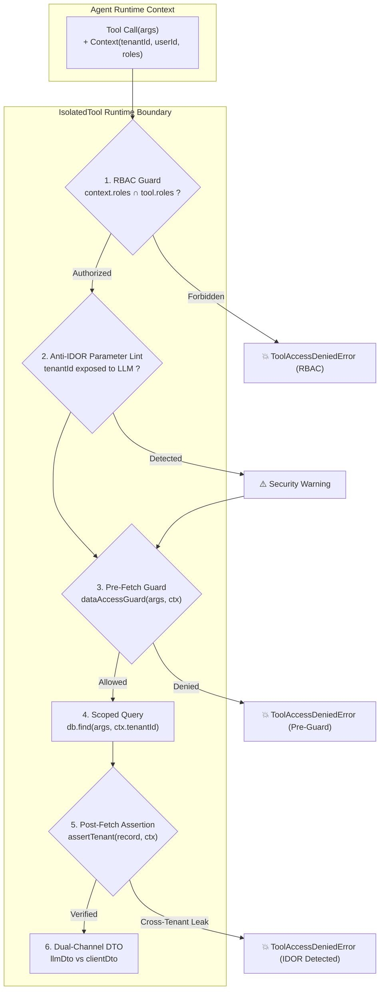

# 🚀 AvantGate v1.7.0 — Release Notes

> **Release Date**: September 25, 2026  
> **NPM Package**: [`avantgate@1.7.0`](https://www.npmjs.com/package/avantgate)  
> **Release Type**: Minor Feature & Security Release — Multi-Tenant Anti-IDOR Enforcement (`createTenantTool`), Native Runtime RBAC Guardrails, Embedded SQLite FinOps Pricing Adapter, GateWall Cockpit Light/Dark Theme & Dynamic Pricing Console, and Modular Documentation Overhaul.

---

## 📌 Executive Summary

The **v1.7.0** release tackles the single most critical security vulnerability in agent tool ecosystems: **Insecure Direct Object References (IDOR) and cross-tenant data leakage**. 

In autonomous agent architectures, leaving tenant scoping to the LLM's prompt parameters is a critical anti-pattern. If a malicious prompt injection tricks the model into specifying another organization's record ID with an spoofed `tenantId`, unhardened tool layers execute unauthorized database access.

AvantGate **v1.7.0** closes this attack vector permanently with **compile-time and runtime Anti-IDOR enforcement**, native **Role-Based Access Control (RBAC)** inside `createIsolatedTool`, and a dedicated `createTenantTool()` abstraction.

Additionally, this release introduces the **SQLite Pricing Adapter** (`avantgate/sqlite-pricing-adapter.ts`), enabling zero-infrastructure persistent token pricing and cost ledgers, along with a full **Light / Dark theme system** and a **Pricing Management UI** inside GateWall Cockpit.

---

### Key Highlights of v1.7.0

1. **🛑 Multi-Tenant Anti-IDOR Tool Boundary (`createTenantTool` & `assertTenant`)**:
   - **No Tenant in LLM Parameters**: Automatically flags/rejects exposing `tenantId` in the LLM's Zod schema. `tenantId` must come exclusively from trusted session context (`ctx.tenantId`).
   - **Post-Fetch Ownership Assertions**: Built-in runtime guard (`assertTenant: (record, ctx) => record.tenantId === ctx.tenantId` or `assertOwnership`). If a database query returns an entity belonging to a different tenant, AvantGate instantly blocks execution and raises `ToolAccessDeniedError`.
   - **Compile-Time Scoping**: `createTenantTool` guarantees that developer queries receive `ctx.tenantId` directly from the execution context.

2. **🔐 Native Runtime Role-Based Access Control (RBAC)**:
   - Declarative `roles: ["admin", "billing"]` configured directly on tools.
   - Evaluated *before* argument parsing and tool execution against `ctx.roles`.
   - Rejects unauthorized tool calls immediately without triggering downstream execution or billing cost.

3. **💾 Embedded SQLite Pricing Adapter (`avantgate`)**:
   - Persistent custom model pricing stored locally in SQLite (`sqlite-pricing-adapter.ts`), replacing hardcoded rate maps with dynamic, queryable pricing.
   - Zero-dependency: works with native Node.js / Bun SQLite drivers with graceful in-memory fallback.

4. **☀️ GateWall Cockpit: Light Theme & Pricing Management UI**:
   - Full **Dark / Light mode** support across all GateWall views with instant CSS variable transitions and persistent theme store.
   - New **Pricing Management Console** (`/pricing`): view, filter, edit, and override model token rates (GPT-4o, Claude 3.5, Mistral, DeepSeek) directly from the visual dashboard.

5. **📚 Modular Documentation Overhaul**:
   - Restructured the documentation tree into clear, domain-specific modules:
     - `docs/security/`: [Anti-IDOR Defense](file:///c:/Users/Bui/Desktop/DevProjets/avantGate/docs/security/anti-idor.md), [Prompt Guardrails](file:///c:/Users/Bui/Desktop/DevProjets/avantGate/docs/security/prompt-guardrails.md), [PII Redaction](file:///c:/Users/Bui/Desktop/DevProjets/avantGate/docs/security/pii-redaction.md), [End-to-End Security](file:///c:/Users/Bui/Desktop/DevProjets/avantGate/docs/security/end-to-end-security.md).
     - `docs/finops/`: [Pre-Flight Budget Guards](file:///c:/Users/Bui/Desktop/DevProjets/avantGate/docs/finops/budget-guards.md), [Pricing Adapters](file:///c:/Users/Bui/Desktop/DevProjets/avantGate/docs/finops/pricing-adapters.md).
     - `docs/agents/`: [Isolated Tools & DTOs](file:///c:/Users/Bui/Desktop/DevProjets/avantGate/docs/agents/isolated-tools.md), [Agent Runtime Manual](file:///c:/Users/Bui/Desktop/DevProjets/avantGate/docs/agents/agent-runtime.md), [Inter-Tool Chaining](file:///c:/Users/Bui/Desktop/DevProjets/avantGate/docs/agents/inter-tool-chaining.md).
     - `docs/workflows/`: [Durable Workflows Engine](file:///c:/Users/Bui/Desktop/DevProjets/avantGate/docs/workflows/durable-workflows.md).
     - `docs/observability/`: [GateWall Cockpit Console](file:///c:/Users/Bui/Desktop/DevProjets/avantGate/docs/observability/gatewall-cockpit.md), [Telemetry & Browser SDK](file:///c:/Users/Bui/Desktop/DevProjets/avantGate/docs/observability/telemetry-and-browser-sdk.md).

---

## 🛡️ Anti-IDOR & Multi-Tenant Pipeline Architecture



---

## 💻 Code Examples

### 1. Hardened Tenant Tool with `createTenantTool`

```typescript
import { z } from "zod";
import { createTenantTool } from "avantgate/agent";

export const getInvoiceTool = createTenantTool({
  id: "get_invoice",
  description: "Fetches invoice details safely scoped to the caller's tenant.",
  // LLM cannot manipulate tenantId: only business parameters are exposed
  parameters: z.object({
    invoiceId: z.string().describe("The invoice identifier"),
  }),
  roles: ["billing", "admin"],
  // Post-fetch ownership assertion: prevents IDOR even if DB query is improperly scoped
  assertTenant: (invoice, ctx) => invoice.tenantId === ctx.tenantId,
  execute: async ({ invoiceId }, ctx) => {
    // Queries are strictly parameterized with verified session context
    return await db.invoices.findUnique({
      where: { id: invoiceId, tenantId: ctx.tenantId },
    });
  },
  llmDto: (invoice) => ({
    invoiceId: invoice.id,
    amount: invoice.total,
    status: invoice.status,
  }),
});
```

### 2. Embedded SQLite Pricing Adapter

```typescript
import { AvantGateControlLayer, SQLitePricingAdapter } from "avantgate";

const pricingAdapter = new SQLitePricingAdapter({
  databasePath: "./data/pricing.db",
});

// Configure dynamic SQLite pricing with in-memory TTL caching
const firewall = new AvantGateControlLayer({
  primary: {
    provider: "openai",
    model: "gpt-4o",
  },
  customPricing: pricingAdapter,
  maxCostUSD: 0.05,
});
```

---

## 📦 Migration Guide & Breaking Changes

- **100% Backwards Compatible**: Existing tools created with `createIsolatedTool` continue to function as expected.
- **Recommended Action**:
  - Replace manual tenant checks with `createTenantTool()` or configure `assertTenant` on sensitive data tools.
  - Review tool parameters to ensure session identifiers (`tenantId`, `orgId`) are stripped from LLM-facing schemas and retrieved from `ToolExecutionContext`.

---

## 🤝 Verification & Quality Assurance

All suites passed with zero regressions:
- Core AI-WAF & Prompt Guardrails
- Pre-flight budget & Denial-of-Wallet caps
- SQLite Pricing Adapter & FinOps persistence
- Financial accounting normalizers (FR/US/UK/CH)
- Multi-tenant Anti-IDOR & RBAC runtime tests (`tests/agent/tool-governance.test.ts`)
- GateWall end-to-end Cockpit & telemetry tests

---

Built with pride by the **AvantGate Contributors**. Zero servers. Zero external DB. 100% in-process security.
