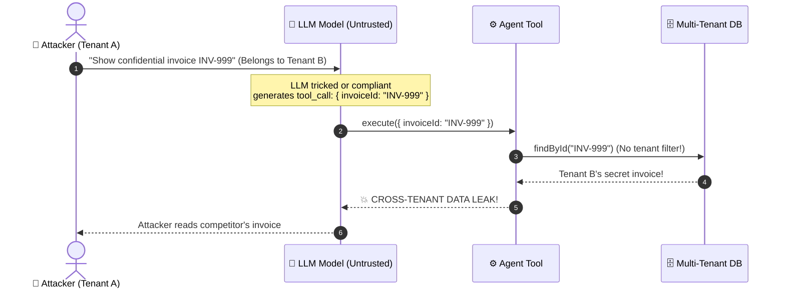
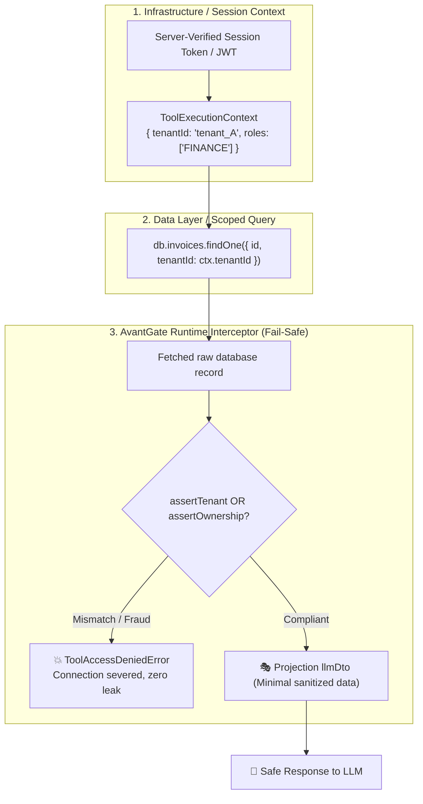
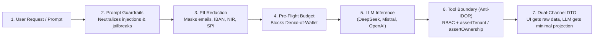

# 🛡️ Anti-IDOR Defense & Multi-Tenant Confinement in AI Agents

This document details the security architecture, defense-in-depth principles, and best practices for protecting AI Agent tools against **IDOR** (*Insecure Direct Object Reference*) vulnerabilities and cross-tenant data leaks.

---

## 🎯 1. The Problem: Why are LLMs Vulnerable to IDOR?

In an AI agent architecture (e.g., Vercel AI SDK, LangChain, AutoGen), the large language model (LLM) acts as an action router: it parses the user query and selects which tools to call along with their exact arguments.

> [!WARNING]
> **The LLM is an Untrusted Boundary.**  
> Even with strict system prompts, **Prompt Injection** attacks (direct or indirect via external documents) can manipulate the model into guessing, enumerating, or injecting identifiers belonging to other organizations.



### ❌ The Classic Anti-Pattern: Model-Supplied Tenancy Parameter

The most widespread flaw consists in asking for `tenantId` in the tool's Zod parameters schema:

```typescript
// ❌ VULNERABLE: Never do this!
parameters: z.object({
  invoiceId: z.string(),
  tenantId: z.string(), // 🚨 Asking the LLM to supply tenantId!
}),
dataAccessGuard: (args, context) => args.tenantId === context.tenantId,
execute: async (args) => {
  return await db.invoices.findById(args.invoiceId); // 🚨 No filter in the DB query!
}
```

**Why is this code flawed?**  
An attacker from Tenant `A` requests invoice `INV-999` (which belongs to Tenant `B`). The LLM compliantly injects `tenantId: "tenant_A"` (its own tenant) and `invoiceId: "INV-999"`. The guard validates that `"tenant_A" === "tenant_A"` and the database returns Tenant `B`'s invoice. Multi-tenant isolation was trusting the honesty of the LLM rather than enforcing it at the data layer.

---

## 🏛️ 2. Three-Tier Defense-in-Depth Architecture

To guarantee airtight isolation, AvantGate applies the **Defense-in-Depth** principle across 3 independent tiers:



### Level 1: Infrastructure Session Context (Tamper-Proof)
The caller's `tenantId`, `userId`, and `roles` are resolved on the server side (from the HTTP session, JWT, or API key) and injected into the [`ToolExecutionContext`](file:///c:/Users/Bui/Desktop/DevProjets/avantGate/src/agent/types.ts). The LLM has zero write access to this object.

### Level 2: Scoped Database Queries
The tool's `execute(args, context)` implementation must include `context.tenantId` in its SQL `WHERE` clause or ORM filter:
```typescript
const record = await db.invoices.findOne({
  where: { id: args.invoiceId, tenantId: context.tenantId }
});
```

### Level 3: AvantGate Runtime Safety Net
Even if a developer forgets the tenant filter in their SQL query or uses a third-party library lacking multi-tenant support, AvantGate intercepts the returned record **before** it is projected to `llmDto` or streamed to the client UI via `clientDto`.

---

## 🔒 3. Compile-Time vs Runtime: Choosing the Right Factory

AvantGate provides two tool creation factories tailored to your security requirements:

| Feature | `createIsolatedTool()` | `createTenantTool()` (Recommended) |
|---|---|---|
| **Target** | General utilities (math, weather, FAQ) | Enterprise data, invoices, CRM records, healthcare |
| **Anti-IDOR Assertion** | Optional | **Mandatory at Compile-Time** (`tsc` error if omitted) |
| **Native RBAC** | Included (`roles`) | Included (`roles`) |
| **PII Protection / DTO** | Included | Included |

### Example with `createTenantTool` (Compile-Time Enforcement):

```typescript
import { createTenantTool, dto } from "avantgate/agent";
import { z } from "zod";

// ❌ TypeScript REFUSES to compile this code if assertTenant is omitted:
// Error: Property 'assertTenant' is missing in type...
export const badInvoiceTool = createTenantTool({
  name: "get_invoice",
  parameters: z.object({ invoiceId: z.string() }),
  async execute(args) {
    return await db.invoices.findById(args.invoiceId);
  }
});

// ✅ Compliant and Fully Secured Code:
export const secureInvoiceTool = createTenantTool({
  name: "get_invoice",
  domain: "billing",
  roles: ["FINANCE", "ADMIN"], // 🔐 Native RBAC enforced automatically
  parameters: z.object({ invoiceId: z.string() }),

  // 🛡️ Compile-Time Requirement: extracts the owner tenantId
  assertTenant: (invoice) => invoice.tenantId,

  async execute(args, context) {
    const invoice = await db.invoices.findOne({
      where: { id: args.invoiceId, tenantId: context.tenantId }
    });
    if (!invoice) throw new Error("Invoice not found");
    return invoice;
  },

  // 🎭 LLM Confinement: the model only receives strictly necessary fields
  llmDto: dto.pick(["invoiceId", "totalAmount", "status"]),
});
```

---

## 🧩 4. Complex Data Models: Using `assertOwnership`

In many architectures, a resource does not carry a flat `record.tenantId` field. AvantGate provides the universal **`assertOwnership`** predicate (synchronous or asynchronous).

### Case 1: Indirect / Nested Relationships (Invoice ➔ Customer ➔ Tenant)
When an invoice belongs to a customer who in turn belongs to an organization's tenant:

```typescript
export const getInvoiceDetailTool = createTenantTool({
  name: "get_invoice_detail",
  parameters: z.object({ invoiceId: z.string() }),

  // 🔍 Navigating nested relationships:
  assertOwnership: (invoice, context) => {
    return invoice.customer?.organization?.tenantId === context.tenantId;
  },

  async execute(args) {
    return await db.invoices.findUnique({
      where: { id: args.invoiceId },
      include: { customer: { include: { organization: true } } }
    });
  }
});
```

---

### Case 2: B2C / User-Centric Models (`userId`)
In B2C applications (e-commerce, healthcare, social networks), resources belong directly to an **individual user** rather than an organization:

```typescript
export const getMedicalReportTool = createTenantTool({
  name: "get_medical_report",
  parameters: z.object({ reportId: z.string() }),

  // 👤 Verify the authenticated user's identity:
  assertOwnership: (report, context) => {
    return report.patientUserId === context.userId;
  },

  async execute(args) {
    return await medicalDb.reports.findById(args.reportId);
  }
});
```

---

### Case 3: Shared Multi-Owner Resources
For joint bank accounts, shared workspaces, or collaborative documents:

```typescript
export const getSharedWorkspaceTool = createTenantTool({
  name: "get_workspace",
  parameters: z.object({ workspaceId: z.string() }),

  // 👥 Verify if the user belongs to authorized members:
  assertOwnership: (workspace, context) => {
    return workspace.memberUserIds.includes(context.userId as string);
  },

  async execute(args) {
    return await db.workspaces.findById(args.workspaceId);
  }
});
```

---

### Case 4: Asynchronous / Remote Verification (Stripe, External ACLs)
When ownership verification requires an API call or a lookup against an external permission service:

```typescript
export const getStripeSubscriptionTool = createTenantTool({
  name: "get_subscription",
  parameters: z.object({ subscriptionId: z.string() }),

  // 🌐 Secure asynchronous resolution:
  assertOwnership: async (subscription, context) => {
    const customer = await stripe.customers.retrieve(subscription.customerId);
    return customer.metadata.tenantId === context.tenantId;
  },

  async execute(args) {
    return await stripe.subscriptions.retrieve(args.subscriptionId);
  }
});
```

---

## 🌐 5. Integration into the End-to-End AvantGate Security Chain

Anti-IDOR defense does not operate in isolation: it forms the **final barrier** in a comprehensive end-to-end security pipeline (*Defense-in-Depth*) orchestrated by AvantGate:



1. **Ingress Prompt Guardrails**: Prevents attackers from manipulating model cognition via prompt injection or system prompt extraction attacks ([Prompt Guardrails Guide](prompt-guardrails.md)).
2. **In-Flight PII Redaction**: Locally redacts private identifiers (NIR, IBAN, phone numbers, emails) with 0 ms network latency prior to external transmission ([PII Redaction Guide](pii-redaction.md)).
3. **Pre-Flight Budgeting**: Guards against Denial-of-Wallet attacks by enforcing token and cost caps before execution ([Budget Guards Guide](../finops/budget-guards.md)).
4. **Tool Isolation & Anti-IDOR**: Prevents horizontal privilege escalation when executing actions against databases or APIs.
5. **Dual-Channel DTO**: Keeps sensitive data out of the model's context window (`llmDto`), while safely streaming rich data to the client UI (`clientDto`).

> 💡 **Complete End-to-End Implementation:** Check the [End-to-End AI Security Guide](end-to-end-security.md).

---

## 📋 6. Developer Security Checklist

Before deploying an AI Agent tool to production, systematically verify this checklist:

- [ ] **No `tenantId` in `parameters`**: Never request tenant or organization identifiers in the Zod schema exposed to the LLM.
- [ ] **Use `createTenantTool`**: Prefer `createTenantTool` to enforce ownership assertions at compile-time.
- [ ] **Dual Verification (DB + Runtime)**: Filter queries upstream in SQL/ORM using `context.tenantId`, and declare `assertTenant` / `assertOwnership` as a runtime safety net.
- [ ] **Native RBAC Enforcement**: Specify `roles: ["ADMIN", ...]` to block unauthorized users at runtime.
- [ ] **Minimal DTO Projections**: Use `llmDto` (`dto.pick`, `dto.boolean`) to return only the minimum data required by the LLM prompt, stripping internal keys, technical IDs, or sensitive fields.
