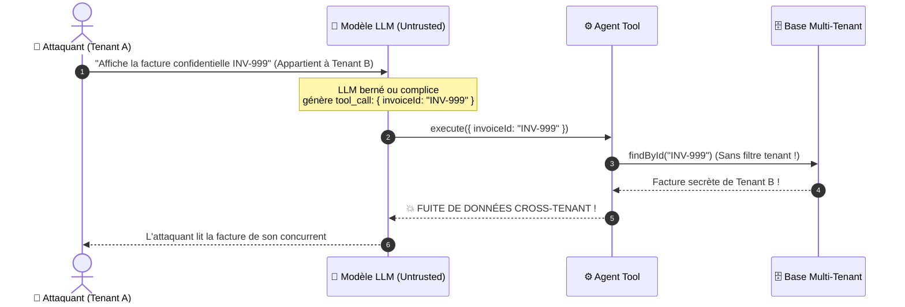
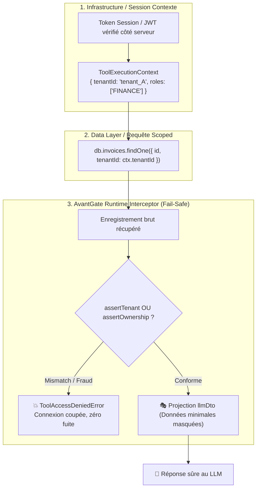
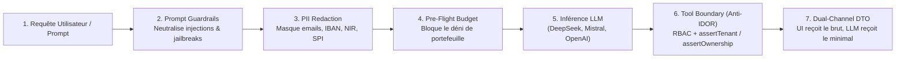

# 🛡️ Anti-IDOR Defense & Multi-Tenant Confinement in AI Agents

Ce document présente l'architecture de sécurité, les principes de défense en profondeur et les bonnes pratiques pour protéger les outils d'Agents IA contre les vulnérabilités **IDOR** (*Insecure Direct Object Reference*) et les fuites de données inter-tenants (*Cross-Tenant Data Leaks*).

---

## 🎯 1. La Problématique : Pourquoi les LLMs sont Vulnérables aux IDOR ?

Dans une architecture d'agent IA (ex: Vercel AI SDK, LangChain, AutoGen), le modèle de langage (LLM) agit comme un routeur d'actions : il analyse la requête utilisateur et choisit les outils à exécuter avec des arguments précis.

> [!WARNING]
> **Le LLM est une frontière non fiable (*Untrusted Boundary*).**  
> Même avec des prompts systèmes stricts, des attaques par **Prompt Injection** (directe ou indirecte via des documents externes) peuvent manipuler le LLM pour lui faire deviner, énumérer ou injecter des identifiants appartenant à d'autres organisations.



### ❌ L'Anti-Pattern Classique : Le paramètre fourni par le modèle

L'erreur la plus répandue consiste à demander le `tenantId` dans les arguments du schéma Zod de l'outil :

```typescript
// ❌ VULNÉRABLE : Ne faites jamais cela !
parameters: z.object({
  invoiceId: z.string(),
  tenantId: z.string(), // 🚨 Demander le tenantId au LLM !
}),
dataAccessGuard: (args, context) => args.tenantId === context.tenantId,
execute: async (args) => {
  return await db.invoices.findById(args.invoiceId); // 🚨 Aucun filtre dans la DB !
}
```

**Pourquoi ce code est faillible ?**  
Un attaquant du Tenant `A` demande la facture `INV-999` (qui appartient au Tenant `B`). Le LLM injecte docilement `tenantId: "tenant_A"` (son propre tenant) et `invoiceId: "INV-999"`. Le guard valide que `"tenant_A" === "tenant_A"` et la base retourne la facture de `B`. L'isolation reposait sur l'honnêteté du LLM plutôt que sur le système de données.

---

## 🏛️ 2. Architecture de Défense en Profondeur (3 Niveaux)

Pour garantir une isolation étanche, AvantGate applique le principe de **Défense en Profondeur** sur 3 niveaux indépendants :



### Niveau 1 : Contexte de Session d'Infrastructure (Inviolable)
Le `tenantId`, le `userId` et les `roles` de l'appelant sont résolus côté serveur (depuis la session HTTP, le JWT ou la clé d'API) et injectés dans le [`ToolExecutionContext`](file:///c:/Users/Bui/Desktop/DevProjets/avantGate/src/agent/types.ts). Le LLM n'a aucun accès en écriture sur cet objet.

### Niveau 2 : Requêtes Scoped en Base de Données
La méthode `execute(args, context)` doit obligatoirement inclure `context.tenantId` dans sa clause `WHERE` SQL ou son filtre ORM :
```typescript
const record = await db.invoices.findOne({
  where: { id: args.invoiceId, tenantId: context.tenantId }
});
```

### Niveau 3 : Le Filet de Sécurité Runtime AvantGate
Même si un développeur oublie le filtre tenant dans sa requête SQL ou utilise une bibliothèque externe sans support multi-tenant, AvantGate intercepte le résultat **avant** qu'il ne soit projeté vers `llmDto` ou envoyé au client UI via `clientDto`.

---

## 🔒 3. Compile-Time vs Runtime : Le choix de la Factory

AvantGate propose deux fonctions de création d'outils adaptées à votre niveau d'exigence :

| Caractéristique | `createIsolatedTool()` | `createTenantTool()` (Recommandé) |
|---|---|---|
| **Cible** | Outils généraux, utilitaires (calcul, météo, FAQ) | Données d'entreprises, factures, dossiers clients, santé |
| **Assertion Anti-IDOR** | Optionnelle | **Obligatoire au Compile-Time** (Refus `tsc` si omise) |
| **RBAC Natif** | Inclus (`roles`) | Inclus (`roles`) |
| **Protection PII / DTO** | Inclus | Inclus |

### Exemple avec `createTenantTool` (Enforcement au Compile-Time) :

```typescript
import { createTenantTool, dto } from "avantgate/agent";
import { z } from "zod";

// ❌ TypeScript REFUSE de compiler ce code si assertTenant est oublié :
// Error: Property 'assertTenant' is missing in type...
export const badInvoiceTool = createTenantTool({
  name: "get_invoice",
  parameters: z.object({ invoiceId: z.string() }),
  async execute(args) {
    return await db.invoices.findById(args.invoiceId);
  }
});

// ✅ Code Conforme et Totalement Sécurisé :
export const secureInvoiceTool = createTenantTool({
  name: "get_invoice",
  domain: "billing",
  roles: ["FINANCE", "ADMIN"], // 🔐 RBAC vérifié automatiquement
  parameters: z.object({ invoiceId: z.string() }),

  // 🛡️ Obligation Compile-Time : extraction du tenant propriétaire
  assertTenant: (invoice) => invoice.tenantId,

  async execute(args, context) {
    const invoice = await db.invoices.findOne({
      where: { id: args.invoiceId, tenantId: context.tenantId }
    });
    if (!invoice) throw new Error("Facture introuvable");
    return invoice;
  },

  // 🎭 Confinement LLM : le modèle ne reçoit que les champs strictement nécessaires
  llmDto: dto.pick(["invoiceId", "totalAmount", "status"]),
});
```

---

## 🧩 4. Modèles de Données Complexes : Utiliser `assertOwnership`

Dans de nombreuses architectures, une ressource n'a pas un champ plat `record.tenantId`. AvantGate fournit le prédicat universel **`assertOwnership`** (synchrone ou asynchrone).

### Cas 1 : Relations Indirectes / Imbriquées (Facture ➔ Client ➔ Tenant)
Quand la facture est rattachée à un client qui lui-même est rattaché au tenant de l'organisation :

```typescript
export const getInvoiceDetailTool = createTenantTool({
  name: "get_invoice_detail",
  parameters: z.object({ invoiceId: z.string() }),

  // 🔍 Navigation dans les relations imbriquées :
  assertOwnership: (invoice, context) => {
    return invoice.customer?.organization?.tenantId === context.tenantId;
  },

  async execute(args) {
    return await db.invoices.findUnique({
      where: { id: args.invoiceId },
      include: { customer: { include: { organization: true } } }
    });
  }
});
```

---

### Cas 2 : Modèles B2C / Centrés Utilisateur (`userId`)
Sur une application B2C (e-commerce, santé, réseau social), les ressources n'appartiennent pas à une entreprise mais directement à un **utilisateur individuel** :

```typescript
export const getMedicalReportTool = createTenantTool({
  name: "get_medical_report",
  parameters: z.object({ reportId: z.string() }),

  // 👤 Vérification de l'identité de l'utilisateur connecté :
  assertOwnership: (report, context) => {
    return report.patientUserId === context.userId;
  },

  async execute(args) {
    return await medicalDb.reports.findById(args.reportId);
  }
});
```

---

### Cas 3 : Ressources Partagées Multi-Propriétaires
Pour les comptes bancaires joints, les dossiers partagés ou les documents collaboratifs :

```typescript
export const getSharedWorkspaceTool = createTenantTool({
  name: "get_workspace",
  parameters: z.object({ workspaceId: z.string() }),

  // 👥 Vérifie si l'utilisateur fait partie des membres autorisés :
  assertOwnership: (workspace, context) => {
    return workspace.memberUserIds.includes(context.userId as string);
  },

  async execute(args) {
    return await db.workspaces.findById(args.workspaceId);
  }
});
```

---

### Cas 4 : Vérification Asynchrone / Distante (Stripe, ACL externe)
Quand la vérification nécessite un appel d'API ou une requête vers un service de permissions externe :

```typescript
export const getStripeSubscriptionTool = createTenantTool({
  name: "get_subscription",
  parameters: z.object({ subscriptionId: z.string() }),

  // 🌐 Résolution asynchrone sécurisée :
  assertOwnership: async (subscription, context) => {
    const customer = await stripe.customers.retrieve(subscription.customerId);
    return customer.metadata.tenantId === context.tenantId;
  },

  async execute(args) {
    return await stripe.subscriptions.retrieve(args.subscriptionId);
  }
});
```

---

## 🌐 5. Intégration dans la Chaîne de Sécurité End-to-End AvantGate

La défense Anti-IDOR ne fonctionne pas en vase clos : elle constitue le **dernier rempart** d'une chaîne de sécurité complète de bout en bout (*Defense-in-Depth*) orchestrée par AvantGate :



1. **Ingress Prompt Guardrails** : Empêche l'attaquant de manipuler le comportement cognitif du modèle via des attaques par injection ou exfiltration de prompt système ([Guide Prompt Guardrails](prompt-guardrails.md)).
2. **In-Flight PII Redaction** : Masque localement les données privées (NIR, IBAN, téléphones, emails) avec 0 ms de latence réseau avant tout envoi externe ([Guide PII Redaction](pii-redaction.md)).
3. **Pre-Flight Budgeting** : Protège contre les attaques de déni de portefeuille (*Denial-of-Wallet*) en plafonnant les coûts et tokens autorisés ([Guide Budget Guards](../finops/budget-guards.md)).
4. **Tool Isolation & Anti-IDOR** : Empêche toute élévation horizontale de privilèges lors de l'exécution d'actions concrètes sur vos bases de données ou vos APIs.
5. **Dual-Channel DTO** : Isole les données confidentielles restantes hors de la fenêtre de contexte du modèle (`llmDto`), tout en alimentant l'UI client en streaming sécurisé (`clientDto`).

> 💡 **Exemple de code complet de bout en bout :** Consultez le [Guide End-to-End AI Security](end-to-end-security.md).

---

## 📋 6. Checklist de Sécurité pour les Développeurs

Avant de déployer un outil d'Agent IA en production, validez systématiquement cette grille :

- [ ] **Pas de `tenantId` dans `parameters`** : Ne jamais demander le tenant ou l'organisation dans le schéma Zod accessible au LLM.
- [ ] **Utilisation de `createTenantTool`** : Préférer `createTenantTool` pour forcer la présence d'une assertion de propriété au moment de la compilation.
- [ ] **Double Vérification (DB + Runtime)** : Filtrer en amont dans la base SQL/ORM avec `context.tenantId`, et déclarer `assertTenant` / `assertOwnership` comme filet de sécurité.
- [ ] **Enforcement RBAC Natif** : Spécifier `roles: ["ADMIN", ...]` pour bloquer au runtime tout utilisateur non habilité.
- [ ] **Projection DTO Minimale** : Utiliser `llmDto` (`dto.pick`, `dto.boolean`) pour ne renvoyer au prompt du LLM que le strict nécessaire et éliminer les clés techniques, identifiants internes ou données confidentielles.
