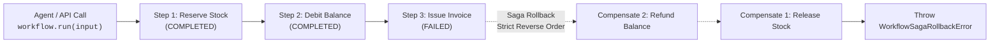

# ⚡ AvantGate Deterministic Workflow Engine (`avantgate/workflow`)

> **$0-Infra Headless Saga Orchestrator & State Machine for Autonomous Agents**  
> Pure TypeScript, deterministic sequential execution, automatic reverse compensation (Saga Pattern), zero-egress PII isolation, and durable Human-in-the-Loop checkpoints.

---

## 🌟 Overview

As AI agents transition from simple single-turn prompt/response interactions to high-stakes autonomous execution, software engineering teams face a critical challenge: **How do we reliably orchestrate multi-step business transactions without sacrificing safety, data integrity, or architectural simplicity?**

Multi-step agent actions in production (e.g., e-commerce order processing, cloud infrastructure provisioning, financial payments, CRM pipeline mutations) cannot afford:
- **State bypass**: An agent hallucinating a shortcut or executing actions out of order.
- **Dangling partial state**: A step failing midway through a 4-step transaction, leaving databases or external APIs in an inconsistent state.
- **Heavy infrastructure tax**: Requiring heavyweight orchestration platforms (Temporal, Celery, distributed Redis queues) for in-process application logic.

`avantgate/workflow` provides a **lightweight, headless, in-process deterministic state machine** specifically engineered for TypeScript backend services and AI agents.



---

## 🏛️ Why a Deterministic Sequential State Machine (Linear FSM)?

A foundational architectural decision in AvantGate was to **deliberately reject arbitrary cyclic graph engines** in favor of a **deterministic, sequential finite state machine (linear FSM)**.

This decision is rooted in 5 core technical pillars:

### 1. Absolute Determinism & Anti-Hallucination Defense
In dynamic graph frameworks, the agent or runtime frequently decides which node to transition to next based on heuristic reasoning. This apparent flexibility introduces critical attack surfaces:
- **Prompt Injection & Salami Attacks**: Malicious users can steer an agent to skip mandatory compliance checks (e.g., bypassing KYC, identity verification, or spending limits).
- **Infinite Loops & Non-Deterministic States**: Cyclic graphs risk endless loops, unhandled deadlocks, or erratic re-executions.

> **AvantGate Guarantee**: The step ordering defined in `steps: [step1, step2, step3]` is a **mathematical invariant**. Step $k$ can **never** execute unless step $k-1$ has succeeded. The LLM has zero authority to alter the workflow topology.

### 2. The Reversible Saga Pattern (Reverse Compensation)
In distributed application architectures, the Saga pattern provides application-level atomicity without heavyweight distributed two-phase commit (2PC) locks:
- If step $k$ fails, every preceding step that succeeded ($k-1$ down to $0$) must be rolled back by its designated compensation handler.
- **Linear Simplicity vs Cyclic Complexity**: In a sequential pipeline $[0 \dots n-1]$, the causal rollback order is strictly and deterministically reversible ($k-1 \to k-2 \to \dots \to 0$).
- In arbitrary cyclic or branching graphs, computing the causal rollback order of partial side effects is an NP-hard, non-deterministic problem that frequently causes data corruption in production.

### 3. Single Source of Truth & Clean Code (KISS / YAGNI)
In a linear sequence, the TypeScript array `steps: [...]` serves as the single source of truth.
- Redundant dependency declarations (such as `dependsOn`) are eliminated, as ordering is naturally and immutably enforced by the array index.
- Zero complex DSLs to learn, zero external YAML or configuration files: 100% type-safe TypeScript code with end-to-end Zod inference.

### 4. Zero-Infra Durability & Human-in-the-Loop (HITL) Checkpoints
The workflow engine natively leverages AvantGate's [`StepStorageAdapter`](file:///c:/Users/Bui/Desktop/DevProjets/avantGate/src/agent/types.ts) ecosystem (`MemoryStorageAdapter`, `PrismaStorageAdapter`, `SQLiteStorageAdapter`, `KeyValueStorageAdapter`).
- When a workflow requires human approval (`ctx.waitForApproval()`), its entire execution snapshot (`stepIndex`, `status`, `results`, `context`) is durably persisted without blocking server threads.
- Upon resumption via `workflow.resume(runId)`, the engine reloads persisted state and immediately resumes at the subsequent step, never replaying previously `COMPLETED` steps.

### 5. Native Integration with AvantGate Tool Governance (v1.3.0)
A workflow is not an isolated silo. It seamlessly exports into an agent-ready tool via `workflow.asTool()`:
- Inherits physical side-effect toxicity profiling (`impact: "READ_ONLY" | "MUTATIVE" | "DESTRUCTIVE"`).
- Any workflow designated as `"DESTRUCTIVE"` automatically enables `requireApproval: true` by default (*Safe-by-Default*).
- Directly governed by AvantGate confinement strategies ([`ReadOnlyToolStrategy`](file:///c:/Users/Bui/Desktop/DevProjets/avantGate/src/agent/strategy/readonly-tool-strategy.ts), [`MaxImpactToolStrategy`](file:///c:/Users/Bui/Desktop/DevProjets/avantGate/src/agent/strategy/max-impact-tool-strategy.ts), [`AccessControlToolStrategy`](file:///c:/Users/Bui/Desktop/DevProjets/avantGate/src/agent/strategy/access-control-tool-strategy.ts)).

---

## 📊 Comparative Architecture Matrix

| Criterion | Dynamic Graphs / DAGs | Heavy Distributed Engines | **AvantGate Workflow (Deterministic FSM)** |
| :--- | :--- | :--- | :--- |
| **Ordering Guarantee** | Heuristic / LLM-directed | Worker queue configuration | **Strictly sequential & deterministic** |
| **Hallucination Resistance** | Low (risk of step skipping) | Neutral (imperative code) | **Maximum (Immutable topology)** |
| **Rollback / Saga** | Manual, complex, or absent | Complex event coordination | **Automatic in strict reverse order ($k-1 \to 0$)** |
| **Required Infrastructure** | Framework runtime dependencies | Cluster: Temporal, Redis, Celery | **$0-Infra (In-Process, Pure TypeScript)** |
| **Human-in-the-Loop (HITL)** | Often blocking or ad-hoc | Complex asynchronous queues | **Native & Non-blocking (`StepStorageAdapter`)** |
| **Agent Tool Conversion** | Requires custom glue code | Requires custom API gateway | **Native in 1 line (`workflow.asTool()`)** |
| **Memory / Bundle Footprint** | Heavy multi-package runtime | Daemons, workers, sidecars | **Ultra-lightweight (< 15 KB, 0 deps except Zod)** |

---

## 📦 Installation & Imports

```bash
npm install avantgate zod
```

Import directly from the dedicated subpath `avantgate/workflow` or from the root package `avantgate`:

```typescript
import {
  defineWorkflow,
  executeWorkflow,
  WorkflowSagaRollbackError,
  WorkflowValidationError,
} from "avantgate/workflow";

// Types
import type {
  WorkflowConfig,
  WorkflowStepConfig,
  WorkflowStepContext,
  WorkflowExecutionContext,
  WorkflowExecutionResult,
  WorkflowInstance,
  WorkflowAsToolOptions,
} from "avantgate/workflow";
```

---

## 🚀 Usage Guide

### 1. Defining a Transactional Workflow

Below is the definition of a multi-step user onboarding workflow:

```typescript
import { defineWorkflow } from "avantgate/workflow";
import { z } from "zod";

export const onboardUserWorkflow = defineWorkflow({
  name: "onboard_user",
  description: "Creates user profile, provisions workspace, and notifies admin",
  roles: ["ADMIN", "MANAGER"],
  impact: "MUTATIVE",

  inputSchema: z.object({
    email: z.string().email(),
    fullName: z.string(),
    plan: z.enum(["starter", "pro"]),
  }),

  steps: [
    {
      name: "create_user_record",
      description: "Creates user in core database",
      async execute(ctx) {
        const user = await db.users.create({
          email: ctx.input.email,
          fullName: ctx.input.fullName,
        });
        return { userId: user.id };
      },
      async compensate(ctx) {
        // Automatically invoked if any subsequent step fails
        const { userId } = ctx.getStepResult<{ userId: string }>("create_user_record");
        await db.users.delete({ id: userId });
      },
    },
    {
      name: "provision_workspace",
      description: "Allocates tenant storage and databases",
      async execute(ctx) {
        const { userId } = ctx.getStepResult<{ userId: string }>("create_user_record");
        const workspace = await cloudProvider.createWorkspace({
          ownerId: userId,
          tier: ctx.input.plan,
        });
        return { workspaceId: workspace.id, url: workspace.url };
      },
      async compensate(ctx) {
        const result = ctx.getStepResult<{ workspaceId: string }>("provision_workspace");
        await cloudProvider.destroyWorkspace(result.workspaceId);
      },
    },
    {
      name: "send_welcome_email",
      description: "Dispatches welcome email with credentials",
      async execute(ctx) {
        const { userId } = ctx.getStepResult<{ userId: string }>("create_user_record");
        const { url } = ctx.getStepResult<{ url: string }>("provision_workspace");
        await mailer.send(ctx.input.email, { userId, url });
        return { delivered: true };
      },
    },
  ],

  // Optional projection of the final output DTO
  outputDto: (result, ctx) => ({
    success: result.status === "COMPLETED",
    userId: result.stepResults.create_user_record.userId,
    workspaceUrl: result.stepResults.provision_workspace.url,
  }),
});
```

---

### 2. Execution & Saga Rollback Handling

When a step fails (thrown exception, network timeout, business logic rejection), the engine immediately stops execution and triggers all previously completed steps' `compensate` handlers in **strictly reverse order**:

```typescript
try {
  const result = await onboardUserWorkflow.run({
    input: {
      email: "alex@enterprise.com",
      fullName: "Alex Rivera",
      plan: "pro",
    },
  });

  console.log("Workflow completed:", result.output);
} catch (error) {
  if (error instanceof WorkflowSagaRollbackError) {
    console.error(`💥 Failed at step [${error.failedStep}]: ${error.originalError.message}`);
    console.warn("Successfully compensated steps:", error.compensatedSteps);

    if (error.failedCompensations.length > 0) {
      // Critical alert: one or more compensation handlers failed (Ops incident)
      console.error("Failed compensations:", error.failedCompensations);
    }
  } else {
    console.error("Unexpected error:", error);
  }
}
```

#### Inspecting `WorkflowSagaRollbackError`
- `error.failedStep` (`string`): Name of the step that threw the originating error.
- `error.originalError` (`Error`): The root cause error.
- `error.compensatedSteps` (`string[]`): Ordered list of step names that were successfully compensated.
- `error.failedCompensations` (`FailedCompensationRecord[]`): List of steps whose compensation handler threw an error (`{ stepName, error }`).

---

### 3. Human-in-the-Loop (HITL) Checkpoints & Durable Resumption

For high-consequence operations (financial wire transfers, infrastructure teardowns, contractual sign-offs), a step can suspend the workflow pending human approval via `ctx.waitForApproval()`:

```typescript
import { defineWorkflow } from "avantgate/workflow";
import { PrismaStorageAdapter } from "avantgate/agent";
import { z } from "zod";

const storage = new PrismaStorageAdapter(prismaClient);

export const highValuePaymentWorkflow = defineWorkflow({
  name: "high_value_payment",
  impact: "DESTRUCTIVE",
  roles: ["FINANCE_OPERATOR"],
  inputSchema: z.object({
    beneficiaryIban: z.string(),
    amountEuros: z.number().positive(),
  }),

  steps: [
    {
      name: "verify_account_balance",
      async execute(ctx) {
        const balance = await bankApi.getBalance();
        if (balance < ctx.input.amountEuros) {
          throw new Error("Insufficient balance to execute wire transfer.");
        }
        return { currentBalance: balance };
      },
    },
    {
      name: "risk_assessment_and_approval",
      async execute(ctx) {
        if (ctx.input.amountEuros > 50000) {
          // Suspends workflow execution and awaits CFO / Treasury authorization
          await ctx.waitForApproval({
            prompt: `Authorization required: Wire transfer of €${ctx.input.amountEuros} to ${ctx.input.beneficiaryIban}`,
            metadata: {
              amount: ctx.input.amountEuros,
              iban: ctx.input.beneficiaryIban,
            },
          });
        }
        return { approvedAutomatically: true };
      },
    },
    {
      name: "execute_wire_transfer",
      async execute(ctx) {
        const transfer = await bankApi.wireTransfer({
          iban: ctx.input.beneficiaryIban,
          amount: ctx.input.amountEuros,
        });
        return { transferId: transfer.id, timestamp: new Date() };
      },
    },
  ],
});
```

#### HITL Lifecycle:

1. **Initial Trigger Execution**:
   ```typescript
   const runResult = await highValuePaymentWorkflow.run({
     runId: "payment-tx-9876",
     storageAdapter: storage,
     input: { beneficiaryIban: "FR76...", amountEuros: 120000 },
   });

   console.log(runResult.status); // "WAITING_APPROVAL"
   console.log(runResult.suspendedStep); // "risk_assessment_and_approval"
   ```

2. **Resumption After Human Authorization (Webhook / Admin Console)**:
   ```typescript
   // Operator reviews and approves the request in the management portal
   const finalResult = await highValuePaymentWorkflow.resume("payment-tx-9876", {
     approved: true,
     feedback: "Approved by Chief Financial Officer",
     storageAdapter: storage,
   });

   console.log(finalResult.status); // "COMPLETED"
   console.log(finalResult.stepResults.execute_wire_transfer.transferId);
   ```

> **Guaranteed Idempotence**: Upon resumption, Step 1 (`verify_account_balance`) is **not** re-executed. Its prior output persisted in `storage` is instantly re-injected into the step execution context.

---

### 4. Agent Tool Conversion (`asTool()`)

Any workflow can be converted in one line into an AI agent tool (`IsolatedTool`) using `.asTool()`:

```typescript
import { ToolRegistry, MaxImpactToolStrategy } from "avantgate/agent";

// 1. Convert workflow into an agent tool
const paymentTool = highValuePaymentWorkflow.asTool({
  storageAdapter: storage,
});

// 2. Register into the tool catalog
const registry = new ToolRegistry();
registry.register(paymentTool);

// 3. Agent Confinement
// An agent bounded by MaxImpactToolStrategy("MUTATIVE") will be
// mathematically barred from invoking this tool (due to impact = "DESTRUCTIVE")!
const safeStrategy = new MaxImpactToolStrategy("MUTATIVE");
const agentTools = safeStrategy.selectTools(registry.getAll(), {
  role: "FINANCE_OPERATOR",
});
```

#### Safe-by-Default Inheritance:
- If the workflow is designated as `impact: "DESTRUCTIVE"`, the resulting tool automatically inherits `requireApproval: true`.
- The tool's parameter validation schema matches the workflow's `inputSchema` Zod definition.
- Declared IAM `roles` are enforced prior to invocation.

---

## 🛡️ Production Best Practices

1. **Idempotent or Compensable Steps**: Ensure that every mutative operation (database insert/update, third-party API call) has a paired `compensate` handler.
2. **Pure `outputDto` Projections**: The `outputDto` function must remain a pure, synchronous transformation of computed step results without initiating external network calls.
3. **Persistent Storage in Production**: Always configure a persistent `StepStorageAdapter` (`PrismaStorageAdapter`, `SQLiteStorageAdapter`, or `KeyValueStorageAdapter`) for workflows that employ `waitForApproval`.
4. **Granular Step Decomposition**: Favor 3-5 focused, single-purpose steps over one monolithic step. Granular steps enable clean, isolated compensation and detailed audit trails.
